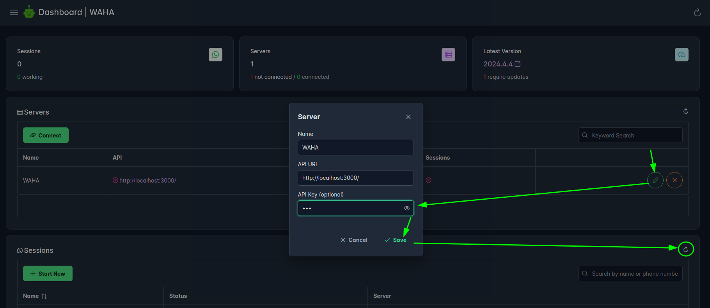

## Overview

Complete guide to install and set up production-ready **WAHA** and **Chatwoot** instances on your own infrastructure!



After completing the installation guide, you'll have:

- **WAHA** on [**http://localhost:3000**](http://localhost:3000)
- **ChatWoot** on [**http://localhost:3009**](http://localhost:3009)



## Requirements

- **Hardware**: VM, VPS, or laptop with minimum **2 CPU** and **4GB RAM**
- **Operating System**: **Debian** or **Ubuntu** based distributions.



## Steps to Deploy

### Step 0: Add DNS Aliases

First, we need to add **DNS Aliases** so everything works as inside docker containers.

👉 **Run the below commands on YOUR LAPTOP/PC**, NOT on the **VPS or VM**:




```bash { title="Add DNS Aliases (MacOS)" }
# Add
echo "127.0.0.1 chatwoot" | sudo tee -a /etc/hosts
echo "127.0.0.1 waha" | sudo tee -a /etc/hosts

# Check it worked - you must see the line like:
# 64 bytes from localhost (127.0.0.1): ...
ping chatwoot
ping waha
```





```bash { title="Add DNS Aliases (Linux)" }
# Add
echo "127.0.0.1 chatwoot" | sudo tee -a /etc/hosts
echo "127.0.0.1 waha" | sudo tee -a /etc/hosts

# Check it worked - you must see the line like:
# 64 bytes from localhost (127.0.0.1): ...
ping chatwoot
ping waha
```



Run **PowerShell as Admin** and execute:

```bash { title="Add DNS Aliases (Windows, PowerShell as Admin)" }
Add-Content -Path "$env:SystemRoot\System32\drivers\etc\hosts" -Value "`n127.0.0.1 chatwoot"
Add-Content -Path "$env:SystemRoot\System32\drivers\etc\hosts" -Value "`n127.0.0.1 waha"

ping chatwoot
ping waha
```




### Step 1: Install Docker

```bash { title="Install Docker" }
# example in ubuntu
apt-get update
apt-get upgrade
curl -fsSL https://get.docker.com -o get-docker.sh
sudo sh get-docker.sh
apt install docker-compose-plugin
```

### Step 2: Download the Required Files

```bash { title="Download files" }
# Download the env files
wget -O .waha.env https://raw.githubusercontent.com/devlikeapro/waha/refs/heads/core/docker-compose/chatwoot/.waha.env
wget -O .chatwoot.env https://raw.githubusercontent.com/devlikeapro/waha/refs/heads/core/docker-compose/chatwoot/.chatwoot.env
# Download docker-compose
wget -O docker-compose.yaml https://raw.githubusercontent.com/devlikeapro/waha/refs/heads/core/docker-compose/chatwoot/docker-compose.yaml
```

### Step 3: Configure Environment Variables

Now you can tweak `.waha.env`, `.chatwoot.env` and `docker-compose.yaml` according to your preferences.

Here are a few environment variables we suggest that you change before going forward (in this guide we'll use **the default values**):

```env { title=".waha.env" }
WAHA_API_KEY_PLAIN=00000000000000000000000000000000
WAHA_API_KEY=sha512:98b6d128682e280b74b324ca82a6bae6e8a3f7174e0605bfd52eb9948fad8984854ec08f7652f32055c4a9f12b69add4850481d9503a7f2225501671d6124648
WAHA_DASHBOARD_USERNAME=admin
WAHA_DASHBOARD_PASSWORD=11111111111111111111111111111111
WHATSAPP_SWAGGER_USERNAME=admin
WHATSAPP_SWAGGER_PASSWORD=11111111111111111111111111111111
```


Even if you're running WAHA on a private server and think the IP is unknown - it's
straightforward for attackers to find and exploit it to send spam or abuse your WhatsApp sessions.

Always set strong, random values (see a guide below) for:

- `WAHA_API_KEY`
- `WAHA_DASHBOARD_PASSWORD`
- `WHATSAPP_SWAGGER_PASSWORD` - you can the same as for `WAHA_DASHBOARD_PASSWORD`

**👉 How to Generate and Hash Api-Key**







### Step 4: Pull Docker Images




If you got the
[➕ WAHA Plus]()
, use the following commands:

```bash { title="Pull Docker Images: WAHA Plus" }
docker login -u devlikeapro -p {KEY}
docker compose pull
docker logout
```

👉 Go to
[**Docker Image Configurator**](https://portal.devlike.pro/docker-image)
to generate the command with the right version.




1. In `docker-compose.yaml` change `image: devlikeapro/waha-plus` to `image: devlikeapro/waha`
2. Run the command:

```bash { title="Pull Docker Images: WAHA Core" }
docker compose pull
```




If you're using **ARM CPU** (like Apple M1/M2, Raspberry Pi etc.).

If you got the
[➕ WAHA Plus]():

1. In `docker-compose.yaml` change `image: devlikeapro/waha-plus` to `image: devlikeapro/waha-plus:arm`
2. Run the commands:

```bash { title="Pull Docker Images: WAHA Plus (ARM)" }
docker login -u devlikeapro -p {KEY}
docker pull devlikeapro/waha-plus:arm
docker logout
```

👉 Go to
[**Docker Image Configurator**](https://portal.devlike.pro/docker-image)
to generate the command with the right version.

---

If you want to run **WAHA Core**:

1. In `docker-compose.yaml` change `image: devlikeapro/waha-plus` to `image: devlikeapro/waha:arm`
2. Run the commands:

```bash { title="Pull Docker Images: WAHA Core (ARM)" }
docker compose pull
```





### Step 5: Prepare ChatWoot Database

```bash { title="Prepare ChatWoot Database" }
docker compose run --rm chatwoot bundle exec rails db:chatwoot_prepare
```

### Step 6: Start the Services

```bash { title="Start Services" }
docker compose up -d
```

### Step 7: Access Your WAHA

**Open** [**http://localhost:3000/dashboard**](http://localhost:3000/dashboard) with credentials:

- User: `admin`
- Password: `11111111111111111111111111111111`

**Add Api Key** to your worker:

- Api-Key: `00000000000000000000000000000000`



### Step 8: Access Your ChatWoot

**Open** and **finish** the onboarding guide on [**http://localhost:3009/**](http://localhost:3009/)


## What is next?

👉 Connect **WhatsApp** to **ChatWoot** in
[**WhatsApp + ChatWoot - Configuration Guide**]()


