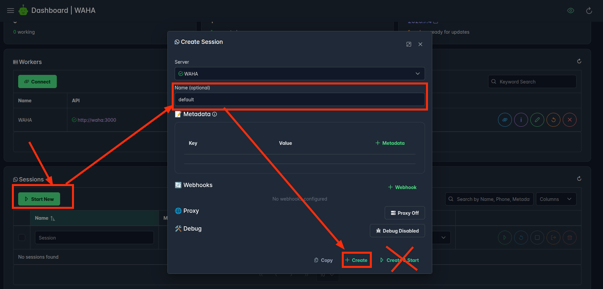

## Overview
Complete guide to install and set up production-ready **WAHA** and **Chatwoot** instances on your own infrastructure!



After completing the configuration guide, you'll have:
- **WhatsApp** connected to [**ChatWoot Inbox**](https://www.chatwoot.com/hc/user-guide/articles/1677492191-adding-inboxes) using **WAHA** [**🧩 ChatWoot App**]()!
- **WAHA** on [**http://localhost:3000**](http://localhost:3000)
- **ChatWoot** on [**http://localhost:3009**](http://localhost:3009)



## Requirements
At this point you should have:
- **WAHA** on [**http://localhost:3000**](http://localhost:3000)
- **ChatWoot** on [**http://localhost:3009**](http://localhost:3009) 

If you don't have it - kindly follow
[**WhatsApp + ChatWoot - Installation Guide**]()



## Steps to Configure ChatWoot App
Now you're ready to setup **WhatsApp** to **ChatWoot** connection using
**WAHA** [**🧩 ChatWoot App**]()!

### Step 1: Create Session in WAHA


- Open [http://localhost:3000/dashboard](http://localhost:3000/dashboard)
- Create a new **default** session
  - ⚠️ Hit **Create**, not **Create & Start**




- Open [http://localhost:3000/dashboard](http://localhost:3000/dashboard)
- Make sure there's **default** session





### Step 2: Copy Webhook URL in WAHA
- Open [http://localhost:3000/dashboard](http://localhost:3000/dashboard)
- Click **Apps**
- Click **Add App**
- Copy **Webhook URL**
- Keep the tab open, we'll fill the fields

### Step 3: Create API Inbox in ChatWoot
- Go to **ChatWoot** [http://localhost:3009](http://localhost:3009)
- Open **Settings → Inboxes**
- Click **Add Inbox**, choose **API**
- Set fields as:
  - **Name**: `WhatsApp - default` (name can be anything, doesn't have to follow that pattern)
  - **Webhook URL**: `http://waha:3009/webhook/chatwoot/...` - Webhook URL from WAHA
- **Finish** creation guide

### Step 4: Collect ChatWoot Fields for WAHA
Now we'll need to find those fields in **ChatWoot**

Check the screenshots below, but here's the path how you can find the values:
- **ChatWoot URL** - put `http://chatwoot:3009`
  - 👉 Note that it's not `localhost`, it's `chatwoot`!
- **Account ID** - find it on **Settings → Account Settings**
- **Account Token** - find it on **(click on profile) → Profile settings**
- **Inbox ID** - find it on **Settings → Inboxes → (inspect browser url, the last part)**
- **Inbox Identifier** - find it on **Settings → Inboxes → {Inbox} → Configuration**





{{< img-sign text="Inbox ID, Inbox Identifier: Settings → Inboxes → {Inbox} → Configuration" >}}

### Step 5: Save App Configuration in WAHA
Click **Save** after you finish all fields.

### Step 6: Test Integration in ChatWoot
Now you can open a new conversation created by WAHA and send `status` or `help` to check that integration is working.

- Go to **ChatWoot** [http://localhost:3009](http://localhost:3009)
- Find new `WhatsApp Integration (WAHA)` conversation
- Send `status` or `help` to test **WAHA <=> ChatWoot** connection

### Step 7: Start Session and Scan QR in ChatWoot

Now we're ready to connect your phone with WAHA and ChatWoot.

For that you'll need to 
[**Link a device**](https://faq.whatsapp.com/1317564962315842/?helpref=uf_share) on your mobile phone using QR code.

Open **WhatsApp** on the phone and click on three dots at the right and **Linked Devices** and be ready to scan QR code


- In `WhatsApp Integration (WAHA)` conversation **send** `start` message
- Open **WhatsApp** on your phone, click **More** (three dots), **Linked Devices**, **Link a device**
- **Scan QR** code from ChatWoot

### Step 8: Test WhatsApp Integration in ChatWoot
Now let's see how ChatWoot WhatsApp integration works!

- Send a message from **another** phone to **a connected** account using **WhatsApp**
- Send a response from **ChatWoot**

## What is next?

👉 Setup **HTTPS** for **ChatWoot** in 
[**WhatsApp + ChatWoot - HTTPS Guide**]()


