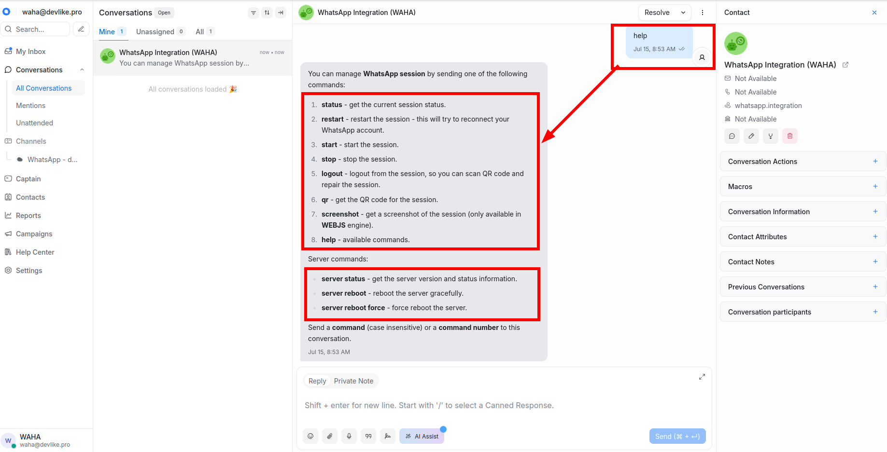





## Overview
By default, when a new message comes from **WhatsApp** to **ChatWoot**, it creates a new contact if there isn't one yet.


Sometimes you want to have all your contacts in **ChatWoot** right away or pull new customers to run a campaign.
This is where `wa/contacts` commands come in handy!

## Contacts Actions
Three actions are available:

- `wa/contacts help` prints the full list of options.
- `wa/contacts status` shows the latest counters for the running or last finished job.
- `wa/contacts pull` starts a new import with default settings.



## Contacts Sync

Use the `wa/contacts pull` command to **sync contacts from WhatsApp to ChatWoot**. It copies your **WhatsApp** contact list into a chosen **ChatWoot** inbox so agents see fresh names, avatars, and identifiers.

- It **only reads** from **WhatsApp**, so nothing changes on the phone and it **pull**s contacts rather than **sync**ing them.
- Each run updates existing profiles in **ChatWoot** and adds contacts you have not imported yet.


Open the **WhatsApp Integration** conversation inside **ChatWoot** (the same thread you use for other WAHA commands).

```bash
wa/contacts help
```



Then run a simple contacts pull like this:

```bash
wa/contacts pull
```

**ChatWoot** replies that the job is queued and processes the contact list in the background.

<div class="text-center">
   
</div>



Run a new `wa/contacts pull` only after the previous job for the same WAHA session has finished.
Other sessions can sync their own contacts at the same time, but overlapping pulls within one session cancel each other out.

Check the current status with `wa/contacts status`.


👇 Check [**Examples**](#examples) below for common use cases and advanced options.


## Use Canned Responses




## Examples
### Refresh contact basics
Keep the defaults and let WAHA import everyone with missing profiles:

```bash
wa/contacts pull
```

### Update avatar
Ideal when you want the profile photos in **ChatWoot**:

```bash
wa/contacts pull --avatar
```

By default, it uses the `--avatar if-missing` option, so it only pulls avatars for contacts without photos in **ChatWoot**.

You can update avatars for all contacts by specifying the `--avatar update` flag:
```bash
wa/contacts pull --avatar update
```



Refreshing avatars can trigger some backoff mechanisms on the WhatsApp side, especially if you have many contacts with profile photos.

The `--avatar if-missing` setting is the safest option to avoid issues.



### Include groups and hidden numbers
Bring in **WhatsApp** groups and LID contacts (users who hide their phone number) in the same run:

```bash
wa/contacts pull --groups --lids --avatar
```

### Full options
This command shows every available flag, but use `wa/contacts help` to explore all latest options.

Adjust the numbers to match your environment:

```bash
wa/contacts pull
  --avatar if-missing
  --groups
  --lids
  --no-attributes
  --batch 50
  --progress 50
  --delay-contact 250ms
  --delay-batch 2s
  --attempts 8
  --timeout 15m
```
