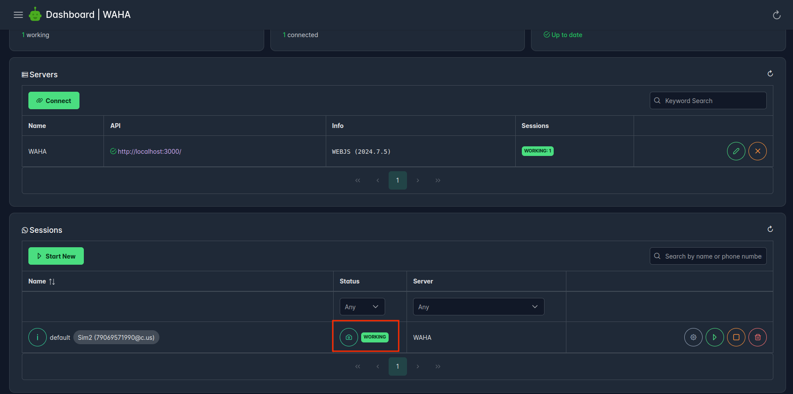

[WAHA](/), Free Self-Hosted WhatsApp API, supports
[**WhatsApp Channels**]()
, a brand-new feature introduced by WhatsApp.
It is a one-way broadcast tool that allows administrators to send various content types such as text, photos, videos,
and polls.
Users receive push notifications from the channel, similar to a private message.

In this article, we give you a **Step-By-Step guide how to send messages to WhatsApp Channels** using
[**WAHA**](/) - free, self-hosted WhatsApp API!

We'll install it on **your own server**, so no suspicious services have access to your WhatsApp account.

<div class="text-center">
   
</div>

## Step 0. Requirements

WAHA works on top of **Docker**, that's the only think you'll need! 
<div class="text-center">
   
</div>

👉 Please follow the 
<a href="https://docs.docker.com/engine/install/" target="_blank">
<b>Docker official guides to install it on Linux, Windows, and macOS</b>
</a>


Docker makes it easy to ship all-in-one solution with the runtime and dependencies. You don't have to worry about
language-specific libraries or chrome installation.

Also, Docker makes installation and update processes so simple, just one command!


## Step 1. Run WAHA
After you installed Docker - you're ready to run WAHA!

```bash
docker run -it --rm -p 3000:3000 --name waha devlikeapro/waha

# It prints logs and the last line must be
# WhatsApp API is running on: http://[::1]:3000
```

It may take time to download the image, depending on your internet speed.

If you're using **ARM** processor (like **Apple M1/M2**, **Raspberry Pi**) run the following commands instead:
```bash
# Download the image
docker pull devlikeapro/waha:arm
# Rename it, so you can use devlikeapro/waha image in other place
docker tag devlikeapro/waha:arm devlikeapro/waha
# Run the same command!
docker run -it --rm -p 3000:3000 --name waha devlikeapro/waha

# It prints logs and the last line must be
# WhatsApp API is running on: http://[::1]:3000
```

👉 Now, open [Dashboard]() at 
<a href="http://localhost:3000/dashboard" target="_blank">
<b>http://localhost:3000/dashboard</b>
</a>

You'll see WAHA Dashboard:


## Step 2. Run session
Now you start **default** session (current status should be `STOPPED`). 

You can leave all configuration parameters by default:


## Step 3. Scan QR
Wait until the session status is `SCAN_QR` and click on "camera" icon:
<br>

👉 If instead of QR you see **Click to reload QR** - **stop** the session and **start** it again.

<br>

You'll see QR code from WhatsApp Web app, now get **your phone** with installed WhatsApp application and **scan the QR**:


The session status will move to `WORKING` status:
 

## Step 4. Get Channel ID
One step before you can send a message to you Channel - you need to get Channel ID in format `123123123@newsletter` 
to know where to send a message.

You can just execute the following curl command:
```bash
curl -X 'GET' \
  'http://localhost:3000/api/default/channels?role=OWNER' \
  -H 'Accept: application/json'
```

In the response you'll see all channels, choose one and copy `id`:

```json
[
  {
    "id": "111111111111111111@newsletter", // <========= copy that
    "name": "Channel Name",
    "role": "OWNER",
    ...
  }
]
```


As alternative to `curl`, you can use [WAHA Swagger]() for that, open it at
<a href="http://localhost:3000/#/channels" target="_blank">
<b>http://localhost:3000/#/channels</b>
</a>, scroll down to **Channels** section.

- Find `GET /api/{session}/channels` endpoint and expand it
- Click **Try it out**
- Choose `role=OWNER` if you have your own channels or `role=ADMIN` if you're admin in the channel (you can not send messages if you're `SUBSCRIBER` in the channel)
- Click **Execute**


## Step 5. Send a message to WhatsApp Channel
Now we're ready to send first messages to WhatsApp Channel via API!

Replace `123123@newsletter` with **your newsletter id**, like `29847512@newsletter` in the bellow command:
```bash
curl -X 'POST' \
  'http://localhost:3000/api/sendText' \
  -H 'Accept: application/json' \
  -H 'Content-Type: application/json' \
  -d '{
  "chatId": "123123123123@newsletter",
  "text": "Hi there!",
  "session": "default"
}'
```

As alternative to `curl`, you can use [WAHA Swagger]() for that, open it at
<a href="http://localhost:3000/#/chatting" target="_blank">
<b>http://localhost:3000/#/chatting</b>
</a>, scroll down to **chatting** section.
- Find `POST /api/sendText` endpoint and expand it
- Click **Try it out**
- Replace `123123@newsletter` with **your** newsletter id, like `29847512@newsletter` in the bellow command
- Click **Execute**


## What is next?
🎉 You've sent the first message to WhatsApp Channel using WhatsApp API! 🎉 

Here's what you can lear next:
- Check the full [**📢 Channels**]() documentation
- Learn more about how to send images [**📤 Send messages**]() to WhatsApp Channel via API
- Learn how to [**📥 Receive messages**]() from WhatsApp Channels via [**🔄 Webhooks**]()
