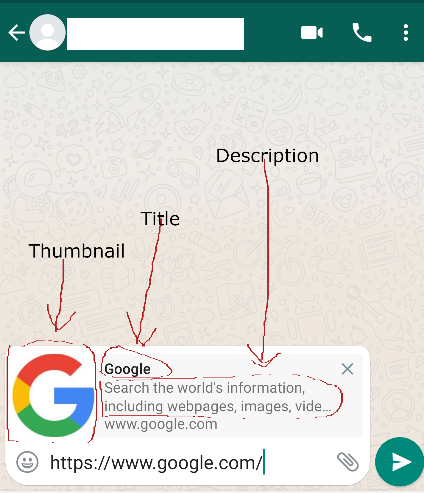

## 🆕 What's New?

### ✅ Mark Messages as Read!

You can now use the brand new [**💬 Read Messages API**]() to mark unread messages as read!

Works across **WEBJS**, **NOWEB**, and **GOWS**!
[#783](https://github.com/devlikeapro/waha/issues/783)

---

### 📥 Group Receipts Tracking

**WEBJS** now includes:

* `message.ack` events for group & status messages
* `message._data.receipts` in [**Get Message by ID**]()

You can now **track delivery for each participant**!
[#495](https://github.com/devlikeapro/waha/issues/495), [#900](https://github.com/devlikeapro/waha/issues/900)

---

### 👁️‍🗨️ Bulk Read Support

Use `messageIds` in [**Send Seen API**]() to mark **multiple messages as read** in one request.
**NOWEB**, **GOWS**

---

### 🧰 Filter by Ack

New `filter.ack` option in [**Get Messages API**]() — filter messages based on delivery status.
**All engines**

### 🟢 Send Reaction to Channels

[**Send Reaction to Channels**]() is now fixed for **GOWS** and **NOWEB** engines.
[#889](https://github.com/devlikeapro/waha/issues/889)

### 🌐 Send Link Custom Preview

[**Send Link Custom Preview**]() has been improved for **GOWS** and **NOWEB** engines.
[#880](https://github.com/devlikeapro/waha/issues/880), [#596](https://github.com/devlikeapro/waha/issues/596)

---

## 🛠️ Fixes & Stability

* **NOWEB**:

    * Fix for `protocolMessage` crash [#932](https://github.com/devlikeapro/waha/issues/932)
    * Message status updated on `/api/sendSeen` [#635](https://github.com/devlikeapro/waha/issues/635)
    * Correct `ack` for new messages (`DEVICE` instead of `UNKNOWN`)
    * Fix sending/receiving in **anonymous groups** and **status**
* **WEBJS**:

    * Auto-restart browser on `ProtocolError` & other errors
      [#244](https://github.com/devlikeapro/waha/issues/244), [#936](https://github.com/devlikeapro/waha/issues/936)
* **GOWS**:

    * Group `message.ack` now sent for **all participants**
    * Stability improvements for group/status messages
    * Fix sending reactions to other users' messages [#894](https://github.com/devlikeapro/waha/issues/894)

---

## ⚙️ Engine Updates

* Updated engines:

    * **NOWEB** - latest version
    * **GOWS** - latest version
    * **WEBJS** - updated **puppeteer** and **chrome** images

---

Check out the full list of updates in the [**🆕 WAHA 2025.4 Changelog**]() and stay tuned for more!
