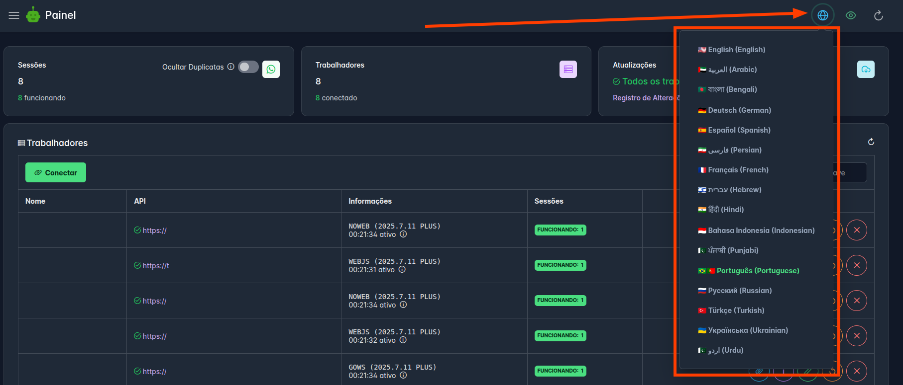

## 🧩 ChatWoot App
Meet the first built-in app in WAHA - [**🧩 ChatWoot App**]()!


WAHA now provides a built-in app to integrate your **WhatsApp** account with **ChatWoot**,
eliminating the need to run n8n or use other third-party products!

We cover all installation and configuration aspects in the following series of articles:


## 👤 Update Contact on Phone
You can now use the 
[**👤 Update Contact API**]()
to **update contacts** in **your phone address book** (and in WhatsApp)!

```http request
PUT /api/{session}/contacts/{chatId}
```

```json { title="Body" }
{
  "firstName": "John",
  "lastName": "Doe"
}
```

See details: 

## 📊 Dashboard i18n

[**📊 Dashboard**]() now has language options available!



## 🆕 Changelog

Check out the full list of updates in the [**🆕 WAHA 2025.7 Changelog**]() and stay tuned for more!
