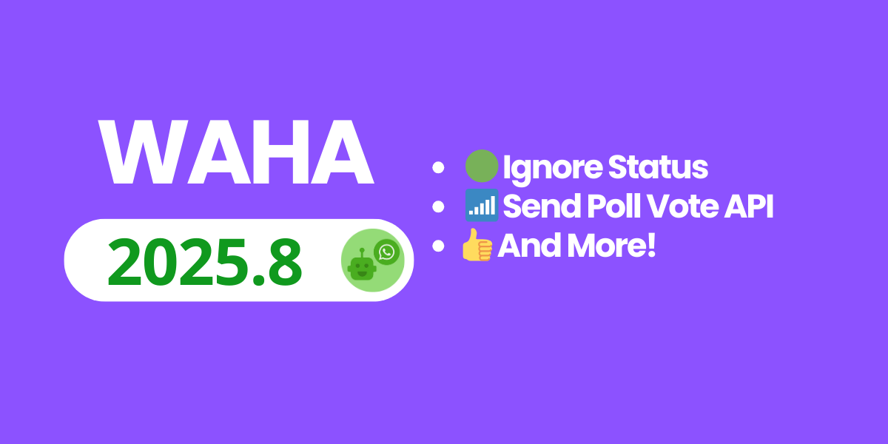

## 🖥️ Sessions - Ignore Chats
You can now ignore incoming chats at the engine level — Status, Groups, and Channels — to keep your processing focused and clean.

- How to: [**🖥️ Sessions — Ignore**]()
- Related: [**🟢 Status**](), [**👥 Groups**](), [**📢 Channels**]()

## 📶 Send Poll Vote API (GOWS)
Programmatically vote in WhatsApp polls using GOWS — works in DMs, Groups, and Channels.

- How to: [**📶 Polls — Send Poll Vote**]()
- Channels example: [**📢 Channels — Send Poll Vote to the Channel**]()

## 🆕 Also New
- Send List Message API (NOWEB, GOWS) — [**📤 Send messages — Send List**]() — Plus only
- Chats: Unread Chat (GOWS) — [**💬 Chats — Unread Chat**]()
- Dashboard: Copy session name button
- WEBJS: `config.webjs.tagsEventsOn`
- GOWS: `/api/sendLocation`
- Dashboard: Simplified Chinese

## 🛠️ Fixes and Updates
Stability fixes across engines (WEBJS, GOWS), Status and Channels improvements, and a GOWS engine/proto bump.

Check the full list in the [**🆕 WAHA 2025.8 Changelog**]().

