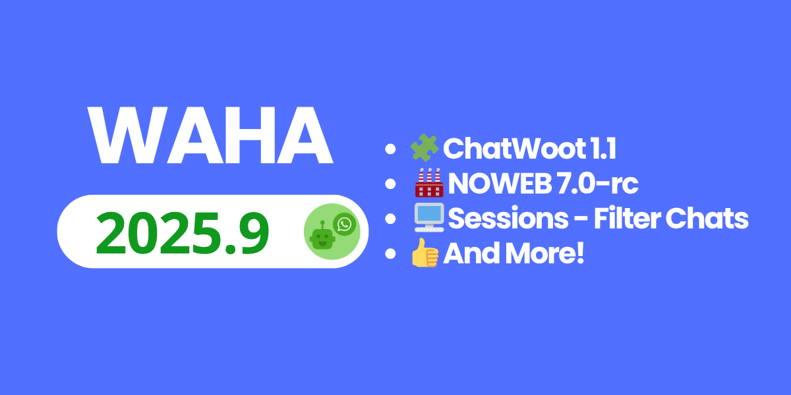

## 🧩 ChatWoot 1.1
ChatWoot integration graduates to **v1.1**, adding conversation control, CSAT surveys, richer language templates, and safer contact handling.

- How to: [**🧩 ChatWoot App**]()
- Highlights: conversation pause/resume, CSAT, share contact/location, broadcast reception, better Brazilian numbers.

## 🏭 NOWEB 7.0-rc
NOWEB climbs to the 7.0-rc engine with fresh builds, proto updates, phone-login fixes, and poll stability improvements.

- Docs: [**🏭 NOWEB**]()
- Engine: `7.0.0` with latest proto `v1027393660` and October 3 engine refresh.

## 🖥️ Sessions - Filter Chats
Dial in signal by filtering broadcasts directly in session config. Flip the new `config.ignore.broadcast` or `WAHA_SESSION_CONFIG_IGNORE_BROADCAST` env to drop broadcast noise without losing send access.

- Guide: [**🖥️ Sessions — Ignore**]()

## 👍 And More!
- WEBJS: `POST /api/sendContactVcard`, automation flag tweaks, Chrome/Puppeteer refresh.
- NOWEB: poll vote/channel fixes, phone login stability, accurate `fromMe` in groups.
- GOWS: panic fix and engine bump to `v1027043088`.
- Dashboard: API key warning, UI polish, simplified Chinese tweaks.
- Full rundown: [**🆕 WAHA 2025.9 Changelog**]().

