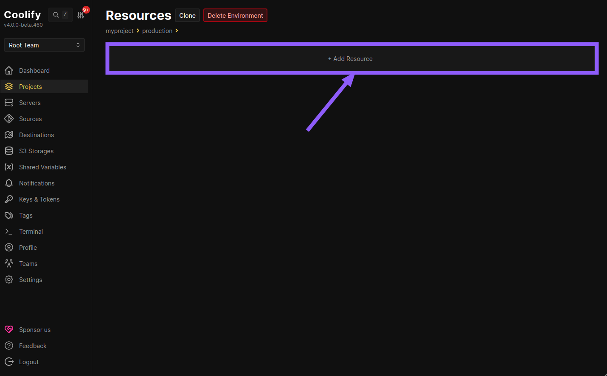
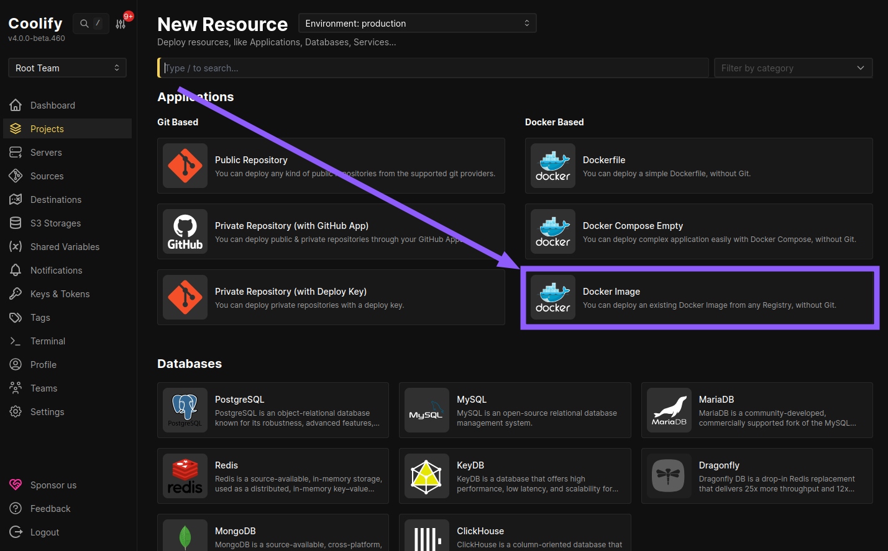
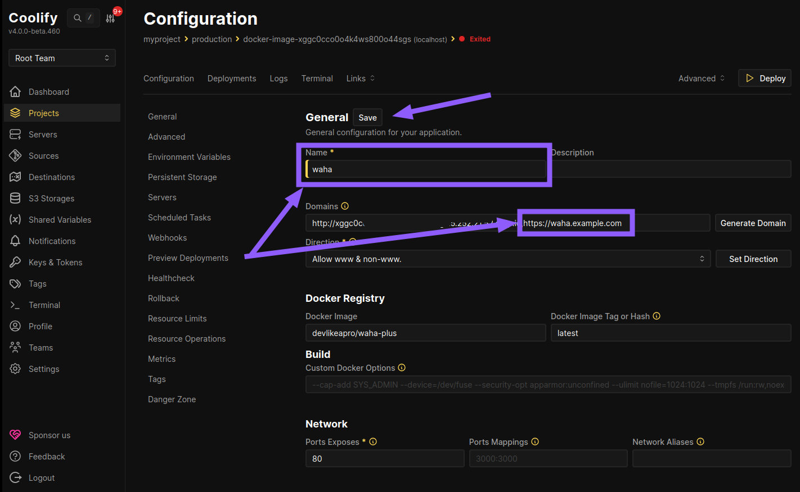
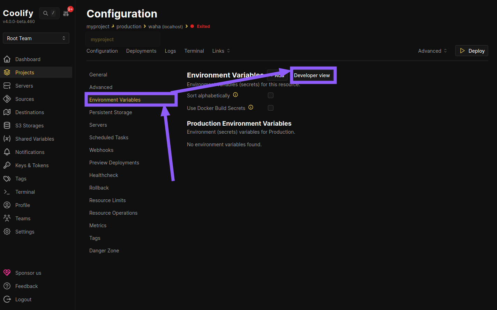
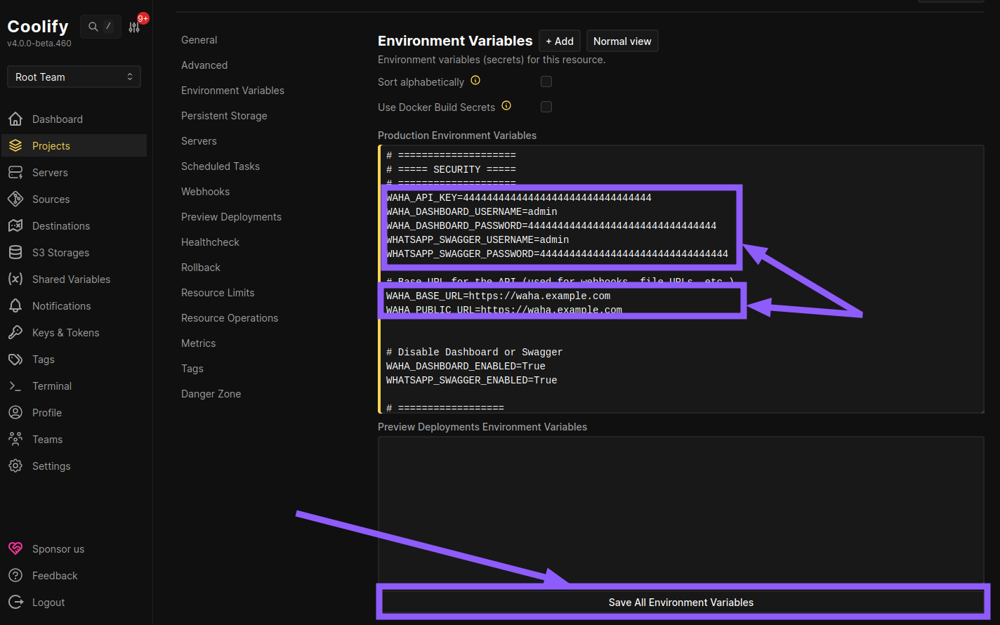
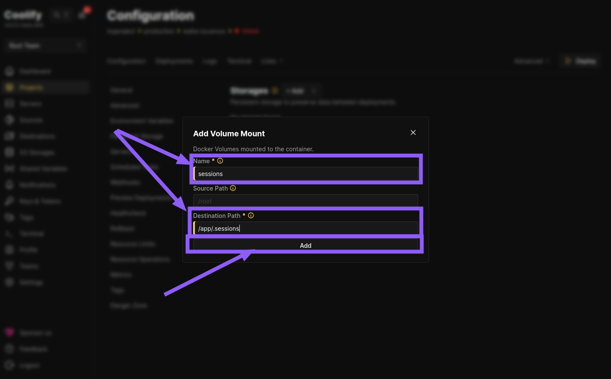
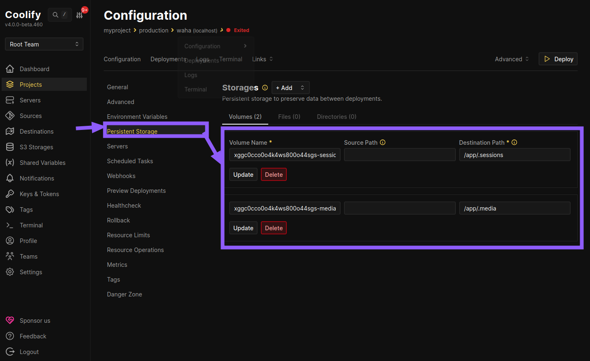
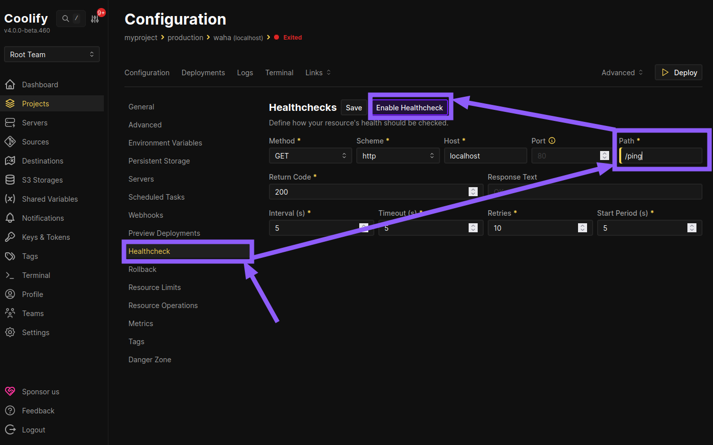
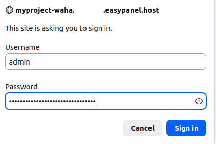
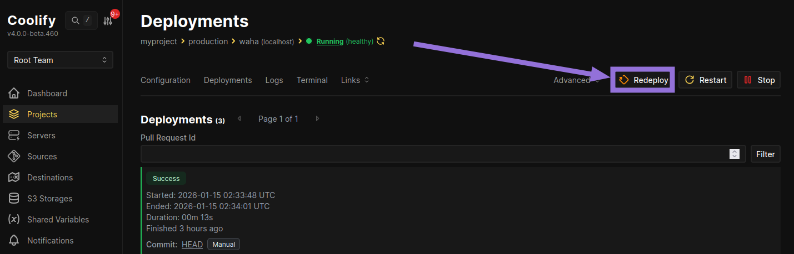

## Overview

With WAHA on [Coolify](https://coolify.io/), you get:
- Free Self-hosted Coolify 
- UI for deployments, env vars, and storage
- Automatic HTTPS with a built-in proxy



- Clean **Ubuntu** or any **Linux-based** OS
- Minimum **2 CPU** and **2 GB RAM**
- **Public IP** address assigned to the server
- (Recommended) **DNS** address assigned to the server for HTTPS - `waha.example.com`


## Install
### Install Coolify

For self-hosted Coolify, run:

```bash {title="Install Coolify"}
curl -fsSL https://cdn.coollabs.io/coolify/install.sh | sudo bash
```

Finish the web setup in your browser.

### Create Project
Create a new project:


Name it `myproject`:


### Create an App
Open `myproject`, and **Add Resource**:



Select **Docker Image**:



Set the **Docker Image**:



For
[**➕ WAHA Plus**]()
, you need first login to docker registry.

Open server console via ssh and run:
```bash {title="Login to Docker Registry"}
docker login -u devlikeapro -p dckr_pat_{YOURKEY}
docker pull devlikeapro/waha-plus:latest
# DO NOT RUN logout for Coolify!
# docker logout 
```

👉🏻 You can find your key in [portal.devlike.pro](https://portal.devlike.pro/)

Then set:
- **Image Name:** `devlikeapro/waha-plus`




- **Image Name:** `devlikeapro/waha`





### App - General
Open **General**:

- Change **Name** to `waha`
- Add a domain for WAHA in **Domains**, like `http://abc.{yourip}.sslip.io,https://waha.example.com` (optional, you can still use auto generated domain name)
- Click **Save**




### App - Advanced

Open **Advanced**, in **Container Names** section enable **Consistent Container Names**:


### App - Environment Variables
Go to **Environment Variables**, click **Developer view** and use values below:




In the example below, we use `44..44` for some environment variables.

You must generate your own using this command:
```bash {title="Generate Secrets"}
uuidgen | tr -d '-'
```



Change `WAHA_BASE_URL` and `WAHA_PUBLIC_URL` to your domain, like `https://waha.example.com`


```bash {title="Environment Variables"}
# ====================
# ===== SECURITY =====
# ====================
WAHA_API_KEY=44444444444444444444444444444444
WAHA_DASHBOARD_USERNAME=admin
WAHA_DASHBOARD_PASSWORD=44444444444444444444444444444444
WHATSAPP_SWAGGER_USERNAME=admin
WHATSAPP_SWAGGER_PASSWORD=44444444444444444444444444444444

# Base URL for the API (used for webhooks, file URLs, etc.)
WAHA_BASE_URL=https://waha.example.com
WAHA_PUBLIC_URL=https://waha.example.com


# Disable Dashboard or Swagger
WAHA_DASHBOARD_ENABLED=True
WHATSAPP_SWAGGER_ENABLED=True

# ==================
# ===== COMMON =====
# ==================
# WhatsApp engine (WEBJS is default, GOWS or NOWEB for better performance)
WHATSAPP_DEFAULT_ENGINE=WEBJS

# "Firefox (YourApp)" in Linked Devices
# WAHA_CLIENT_DEVICE_NAME=YourApp


# ===================
# ===== LOGGING =====
# ===================
# Log format: JSON (for log management systems) or PRETTY (for development)
WAHA_LOG_FORMAT=JSON

# Log level: info, debug, error, warn
WAHA_LOG_LEVEL=info

# Don't print QR codes in logs
WAHA_PRINT_QR=False

# =========================
# ===== MEDIA STORAGE =====
# =========================
# Local storage (default)
WAHA_MEDIA_STORAGE=LOCAL
WHATSAPP_FILES_LIFETIME=0
WHATSAPP_FILES_FOLDER=/app/.media
```



### App - Storage
Open **Persistent Storage**, add a **Volume Mount**


Create **2 volumes**:
1. **Sessions**
- Name: `sessions`
- Destination path: `/app/.sessions`

2. **Media**
- Name: `media`
- Destination path: `/app/.media`



Click on **Persistent Storage** again to see all volumes:



### App - Healthcheck
Open **Healthcheck**, set **Path** as `ping`, click **Enable Healthcheck**



### App - Deployments
Open **Deployments**, click **Deploy** to pull the image and start the app:


When it finishes, click **Links** and open any link to open WAHA:


### Check WAHA

Use `admin` as **Username** and your generated `WAHA_DASHBOARD_PASSWORD` to log in:

<div class="text-center">



</div>

You'll see **Swagger** documentation. Now click **Dashboard**:


Enter your `WAHA_API_KEY` to connect:


Now you can **Create & Start** a new session:


**Scan the QR code** using your WhatsApp app:


## Update
When there's a new version, click **Redeploy** to pull the latest image.



## What's next?


