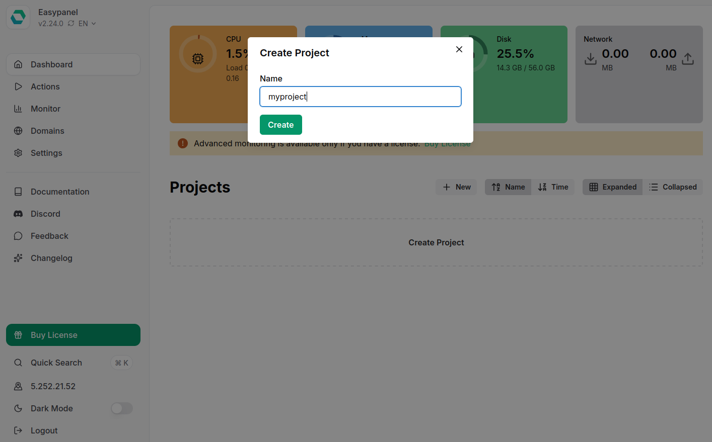
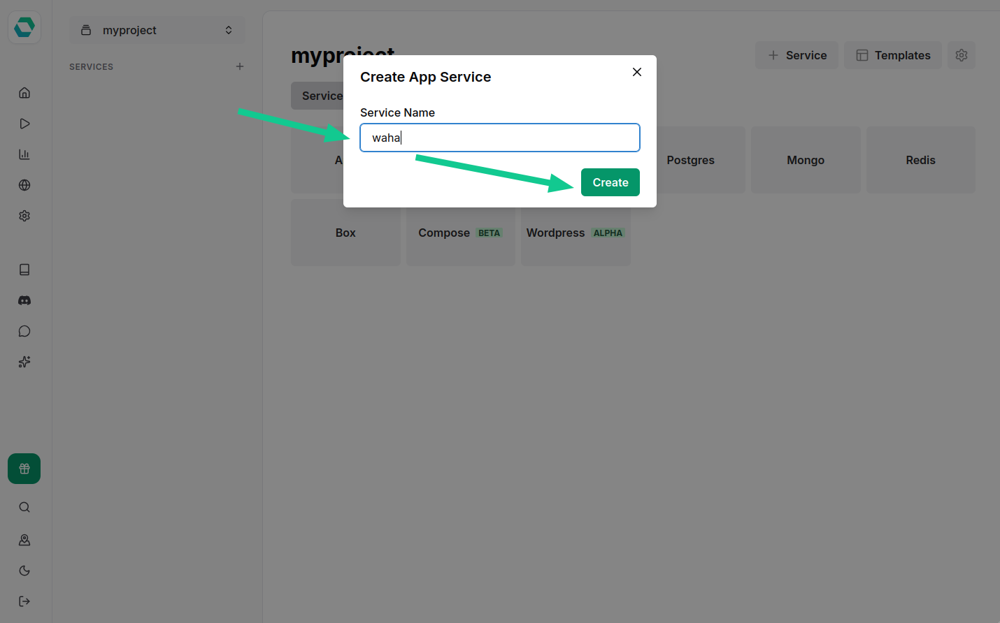
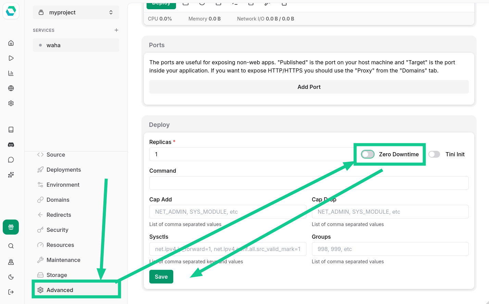
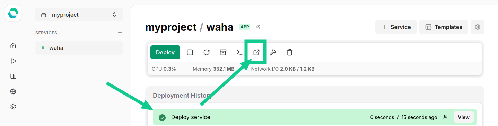
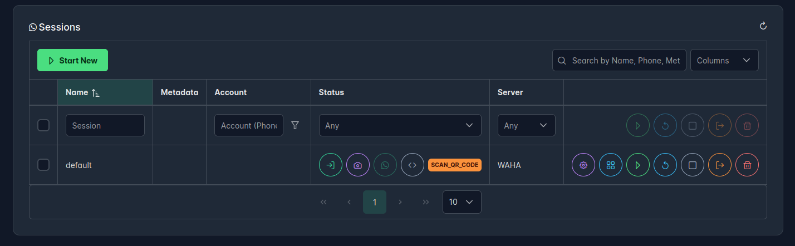

## Overview


With WAHA on EasyPanel, you get:
- A public DNS name like `https://myproject-waha.<ID>.easypanel.host/`
- Automatic HTTPS handling
- Easy UI for deployments, env vars, and storage



- Clean **Ubuntu** or any **Linux-based** OS
- Minimum **2 CPU** and **2 GB RAM**
- **Public IP** address assigned to the server
- **No DNS required up front** because EasyPanel provides built-in DNS.


## Install
### Install EasyPanel

Install [EasyPanel](https://easypanel.io/) on a fresh Linux server:

```bash {title="Install EasyPanel"}
curl -sSL https://get.easypanel.io | sh
```

Finish the web setup in your browser.

### Create Project
Now, we need to **create a project** :


Name it `myproject`:



### Create an App
Open `myproject`, add a new **Service**, and choose **App**:


Name it `waha`:



### App - Docker Image
Open the **waha** service and click **Docker Image**:


Fill the fields based on the WAHA version you'll use.

You can change it later in the **Source** tab for the `waha` service.



For 
[**➕ WAHA Plus**]()
, use the following:

- **Image:** `devlikeapro/waha-plus`
- **Username:** `devlikeapro`
- **Password:** `{KEY}`




- **Image:** `devlikeapro/waha`





👉 Go to
[**Docker Image Configurator**](https://portal.devlike.pro/docker-image)
to generate the command with the right version.


### App - Environment Variables
Go to **Environment** and paste the environment variables below.



In the example below, we use `44..44` for some environment variables.

You must generate your own using this command:
```bash {title="Generate Secrets"}
uuidgen | tr -d '-'
```



```bash {title="Environment Variables"}
# ====================
# ===== SECURITY =====
# ====================
WAHA_API_KEY=44444444444444444444444444444444
WAHA_DASHBOARD_USERNAME=admin
WAHA_DASHBOARD_PASSWORD=44444444444444444444444444444444
WHATSAPP_SWAGGER_USERNAME=admin
WHATSAPP_SWAGGER_PASSWORD=44444444444444444444444444444444

# Disable Dashboard or Swagger
WAHA_DASHBOARD_ENABLED=True
WHATSAPP_SWAGGER_ENABLED=True

# ==================
# ===== COMMON =====
# ==================
# WhatsApp engine (WEBJS is default, GOWS or NOWEB for better performance)
WHATSAPP_DEFAULT_ENGINE=WEBJS

# "Firefox (YourApp)" in Linked Devices
# WAHA_CLIENT_DEVICE_NAME=YourApp

# Base URL for the API (used for webhooks, file URLs, etc.)
WAHA_BASE_URL=https://$(PRIMARY_DOMAIN)
WAHA_PUBLIC_URL=https://$(PRIMARY_DOMAIN)

# ===================
# ===== LOGGING =====
# ===================
# Log format: JSON (for log management systems) or PRETTY (for development)
WAHA_LOG_FORMAT=JSON

# Log level: info, debug, error, warn
WAHA_LOG_LEVEL=info

# Don't print QR codes in logs
WAHA_PRINT_QR=False

# =========================
# ===== MEDIA STORAGE =====
# =========================
# Local storage (default)
WAHA_MEDIA_STORAGE=LOCAL
WHATSAPP_FILES_LIFETIME=0
WHATSAPP_FILES_FOLDER=/app/.media
```

### App - Storage

Go to the **Storage** tab and add a **Volume Mount**:


Create **two volumes**:
1. **Sessions**
- Name: `sessions`
- Mount path: `/app/.sessions`

2. **Media**
- Name: `media`
- Mount path: `/app/.media`


This is what volumes should look like in the end:



On the server, you can find the files later in these folders:
- `/etc/easypanel/projects/myproject/waha/volumes/sessions`
- `/etc/easypanel/projects/myproject/waha/volumes/media`

The pattern is `/etc/easypanel/projects/[project]/[service]/volumes/[volume]`


### App - Advanced

Go to the **Advanced** tab and **disable** **Zero Downtime** deployment.




### App - Deploy
Go to the **Deployments** tab and click **Deploy**.


When it finishes, click the **Open** icon to open WAHA.



### Check WAHA

Use `admin` as **Username** and your generated `WAHA_DASHBOARD_PASSWORD` to log in:

<div class="text-center">


</div>

You'll see **Swagger** documentation. Now click **Dashboard**:


Enter your `WAHA_API_KEY` to connect:


Now you can **Create & Start** a new session:


**Scan the QR code** using your WhatsApp app:




## Update

When you want to update the image, trigger a **Force Build** on the **Deployments** tab:


## What's next?


