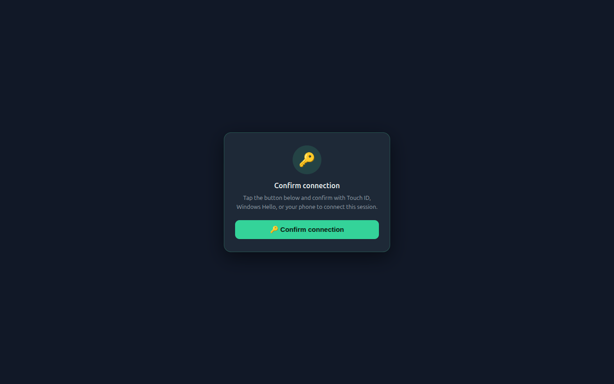

## What is a passkey?

A **passkey** is a key pair stored by your device instead of a password. The private key never leaves the
authenticator - Touch ID, Windows Hello, a security key, your phone - and logging in means signing a random
challenge from the server with it.

The browser API behind it is [**WebAuthn**](https://webauthn.guide/), part of the
[FIDO2](https://fidoalliance.org/fido2/) standard. If you want a deeper read, [passkeys.dev](https://passkeys.dev/)
is the best starting point.

WhatsApp now asks for one on some accounts when you link a device. The session doesn't go straight from the QR code
to `WORKING` - it stops at `PASSKEY_REQUIRED` and waits for a signed challenge.

## Why your backend can't do it alone

WebAuthn is bound to an origin. The browser only lets you call:

```javascript
navigator.credentials.get({ publicKey: { rpId: "web.whatsapp.com", ... } })
```

from a page whose origin **is** `web.whatsapp.com`. Your app runs somewhere else, so the browser blocks the call.
There's no header, no flag, no proxy that works around it - that's the whole point of the standard.

So somebody has to run `navigator.credentials.get` on the `web.whatsapp.com` origin. That somebody is a browser
extension.

## The extension
We publish one, and it's the same one the [**📊 Dashboard**]() uses:

- **Chrome / Edge / Brave** - [chromewebstore.google.com/detail/ghpdcgnjffaaekflfpcgkgpbafmjldcp](https://chromewebstore.google.com/detail/ghpdcgnjffaaekflfpcgkgpbafmjldcp)
- **Firefox** - [addons.mozilla.org/firefox/addon/whatsapp-browser-extension](https://addons.mozilla.org/firefox/addon/whatsapp-browser-extension/)



The extension is **stateless**. It knows nothing about your server, your API key, or your session. It takes a WebAuthn
challenge, opens `web.whatsapp.com`, signs it there, and hands the assertion back. One installed extension works with
every WAHA instance and every integrator - there is nothing to configure.

Fetching the challenge and submitting the assertion stays on your side. That's what makes this usable in your own
branded login flow: **your users never see the WAHA dashboard**.


The extension is **brand-unaware on purpose**. It's called *WhatsApp Browser Extension*, its store listing says it
"helps securely complete a WhatsApp session connection", and the card it shows on `web.whatsapp.com` just reads
*Confirm connection*. Nothing in it names WAHA - not the listing, not the icon, not the confirmation card.

So you can point your customers straight at the store link above and it stays your product. Nothing to fork, nothing
to rebrand.


## The flow

Three steps, and only the middle one involves the extension:

1. Ask WAHA for the challenge.
2. Ask the extension to sign it.
3. Send the signed assertion back to WAHA.

## Step 1: Detect the extension

The two builds talk differently. Chrome exposes `chrome.runtime.sendMessage` to any page via
`externally_connectable`; Firefox doesn't support that for web pages, so it bridges through a content script and
`window.postMessage`. Feature-detect and pick one.

```javascript
const EXTENSION_ID = "ghpdcgnjffaaekflfpcgkgpbafmjldcp";
const TIMEOUT_MS = 300;

function isFirefox() {
  // Firefox exposes window.chrome too, so !!window.chrome is not a Chromium test
  return /firefox/i.test(navigator.userAgent);
}

function pingChrome() {
  return new Promise((resolve) => {
    if (!window.chrome?.runtime?.sendMessage) return resolve(false);
    const timer = setTimeout(() => resolve(false), TIMEOUT_MS);
    chrome.runtime.sendMessage(EXTENSION_ID, { type: "waha-passkey-ping" }, (resp) => {
      clearTimeout(timer);
      resolve(!chrome.runtime.lastError && resp?.ok === true);
    });
  });
}

function pingFirefox() {
  return callFirefox("waha-passkey-ping", null, TIMEOUT_MS)
    .then(() => true)
    .catch(() => false);
}

const hasExtension = await (isFirefox() ? pingFirefox() : pingChrome());
```

Ping on page load, not when the session hits `PASSKEY_REQUIRED` - by then the user is mid-login and installing an
extension costs them time. Show an install banner early if it's missing.

The Firefox bridge, used by both the ping and the sign call:

```javascript
// Signing waits for the user to click and touch their authenticator, so give it
// minutes, not seconds. Only the ping should time out fast.
function callFirefox(type, challenge, timeoutMs = 120_000) {
  return new Promise((resolve, reject) => {
    const requestId = crypto.randomUUID();
    const timer = setTimeout(() => {
      cleanup();
      reject(new Error("No response from the extension"));
    }, timeoutMs);

    function onMessage(event) {
      if (event.source !== window) return; // ignore iframes
      const data = event.data;
      if (data?.source !== "waha-passkey-extension" || data.requestId !== requestId) return;
      cleanup();
      if (!data.ok) return reject(new Error(data.error || "Signing failed"));
      resolve(data);
    }

    function cleanup() {
      clearTimeout(timer);
      window.removeEventListener("message", onMessage);
    }

    window.addEventListener("message", onMessage);
    window.postMessage(
      { source: "waha-passkey-page", requestId, type, challenge },
      window.location.origin,
    );
  });
}
```

Note there's no extension ID on the Firefox side - `postMessage` to your own window is picked up by whichever
compatible content script is present.

## Step 2: Get the challenge and sign it

Watch the [`session.status`]() event. When the status is
`PASSKEY_REQUIRED`, the `data` field already carries the WebAuthn request options. If you'd rather pull it:

```http request
GET /api/{session}/auth/passkey/challenge
```

```jsonc { title="Response" }
{
  "challenge": "9WVUYm9AsQ...",
  "timeout": 60000,
  "rpId": "web.whatsapp.com",
  "allowCredentials": [
    {
      "id": "AX8bTgH2...",
      "type": "public-key",
      "transports": ["internal", "hybrid"]
    }
  ],
  "userVerification": "required"
}
```

It returns `422 Unprocessable Entity` when no challenge is pending.

Hand that object to the extension as-is:

```javascript
function signChrome(challenge) {
  return new Promise((resolve, reject) => {
    chrome.runtime.sendMessage(
      EXTENSION_ID,
      { type: "waha-passkey-sign", challenge },
      (resp) => {
        if (chrome.runtime.lastError) return reject(new Error(chrome.runtime.lastError.message));
        if (!resp?.ok) return reject(new Error(resp?.error || "Signing failed"));
        resolve(resp.assertion); // credential.toJSON() - a standard WebAuthn assertion
      },
    );
  });
}

function sign(challenge) {
  return isFirefox()
    ? callFirefox("waha-passkey-sign", challenge).then((data) => data.assertion)
    : signChrome(challenge);
}
```

The extension opens a `web.whatsapp.com` tab and shows a confirmation card there. `navigator.credentials.get()` needs
a user gesture in that tab, so the user clicks the button, touches their authenticator, and the tab closes itself. The
extension resolves with `credential.toJSON()` - a standard WebAuthn assertion.

That means signing takes as long as the user takes. Don't put a short timeout on it.

## Step 3: Submit the assertion

Post it back, unchanged:

```http request
POST /api/{session}/auth/passkey
```

```jsonc { title="Body" }
{
  "id": "AX8bTgH2...",
  "rawId": "AX8bTgH2...",
  "type": "public-key",
  "response": {
    "clientDataJSON": "eyJ0eXBl...",
    "authenticatorData": "SZYN5YgO...",
    "signature": "MEUCIQD...",
    "userHandle": "MTIzNDU2"
  }
}
```

All three steps together:

```javascript
const headers = { "X-Api-Key": apiKey };

// 1. the challenge from WAHA
const challenge = await fetch(`${baseUrl}/api/${session}/auth/passkey/challenge`, { headers })
  .then((r) => r.json());

// 2. the extension signs it on the whatsapp.com origin
const assertion = await sign(challenge);

// 3. back to WAHA
await fetch(`${baseUrl}/api/${session}/auth/passkey`, {
  method: "POST",
  headers: { ...headers, "Content-Type": "application/json" },
  body: JSON.stringify(assertion),
});
```

Most of the time the session goes straight to `WORKING` from here.

## The confirmation step

Occasionally WhatsApp shows a 4-digit code on the phone and wants the user to confirm it matches. The session moves
to `PASSKEY_CONFIRMATION_REQUIRED` and the code arrives on the `session.status` event - or:

```http request
GET /api/{session}/auth/passkey/confirmation
```

```jsonc { title="Response" }
{
  "code": "1234"
}
```

Show it. Once the user says it matches the one on their phone:

```http request
POST /api/{session}/auth/passkey/confirm
```

This step is rare - most pairings skip it.

## When the extension isn't installed

Don't dead-end the user. The dashboard falls back to a script the operator pastes into the DevTools console on
`web.whatsapp.com` - it renders a button, calls `navigator.credentials.get()` behind that click (WebAuthn needs a
user gesture), and copies the assertion to the clipboard. Then they paste it into a textarea and you `POST` it the
same way.

It's ugly, but it works on any browser, and it's the same three steps - only the middle one moves to the console.

## Using your own extension

If you publish your own build of the extension, use its ID in `EXTENSION_ID` in the code above.

For the [**📊 Dashboard**]() to pick it up, set:

```bash
WAHA_DASHBOARD_PASSKEY_EXTENSION_ID=your-chrome-extension-id
WAHA_DASHBOARD_PASSKEY_EXTENSION_FIREFOX_URL=https://addons.mozilla.org/firefox/addon/your-addon/
```

## Read more

- [**🖥️ Sessions - Passkey**]() - the full API reference
- [**📊 Dashboard**]() - what we built on top of it
- [WebAuthn Guide](https://webauthn.guide/) and [passkeys.dev](https://passkeys.dev/) - the standard itself
