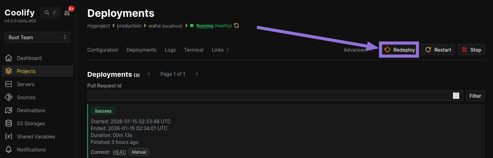
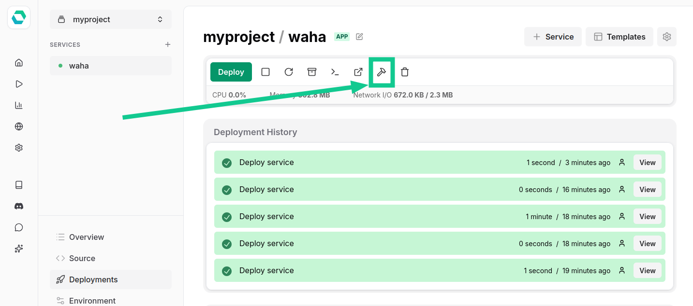

This guide covers how to update **WAHA** to the latest version depending on how you deployed it:


Your sessions will survive the update as long as session data is persisted via one of the supported
[**🗄️ Storages**]():
- **Local** — a volume mounted to `/app/.sessions`
- **PostgreSQL** or **MongoDB** — external database


## Docker

👉 Installed using [Deploy WAHA on Docker]() guide? Here's how to update.

When there's a new version of WAHA, update it with these commands.



```bash {title="Update WAHA Core"}
docker compose pull
docker compose up -d
```



```bash {title="Update WAHA Plus"}
# Login to pull the latest Plus image
docker login -u devlikeapro -p {KEY}
docker compose pull
docker logout

docker compose up -d
```


If you specified an exact version tag in `docker-compose.yaml`, like:

```yaml
image: devlikeapro/waha-plus:latest-2024.7.8
```

Remember to update it to the new `latest-{YEAR}.{MONTH}.{BUILD}` tag before pulling.




You can verify the running version and check logs after updating:

```bash
# Check running containers
docker compose ps

# Show recent logs
docker compose logs --since 1h
```

## Coolify

👉 Installed using [Deploy WAHA on Coolify]() guide? Here's how to update.

When there's a new version, open your WAHA app in Coolify and click **Redeploy** to pull the latest image and restart the service:



Coolify will pull the latest image and restart the container automatically.

## EasyPanel

👉 Installed using [Deploy WAHA on EasyPanel]() guide? Here's how to update.

When you want to update the image on EasyPanel, go to the **Deployments** tab of your `waha` service and click **Force Build**:



EasyPanel will pull the latest image and redeploy the service.
