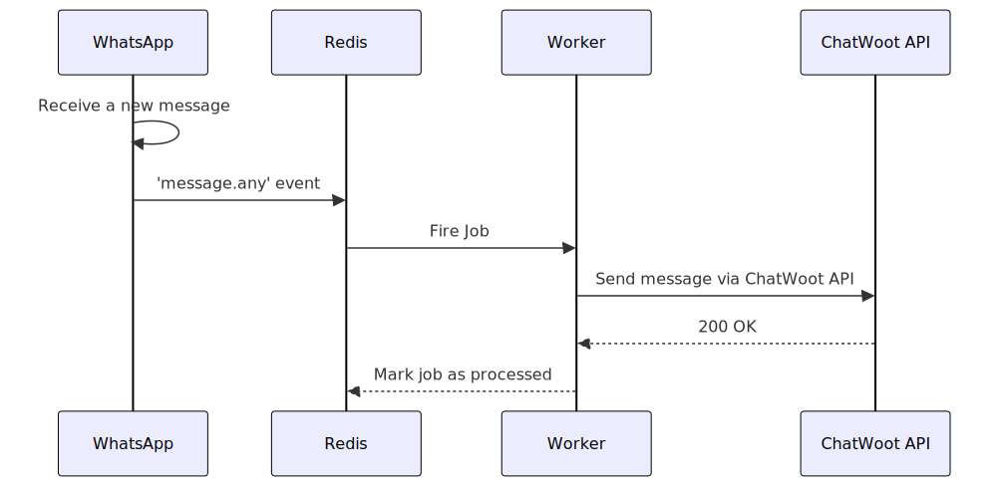
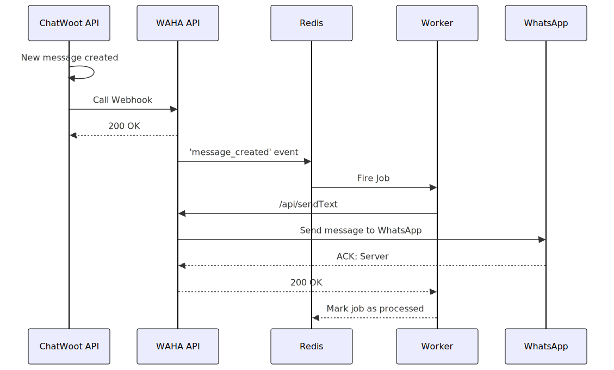

<div></div>

**Apps** connect **WhatsApp** with **external services** using **Redis** as a message broker. 

**Apps** architecture consists of:
- **HTTP API**, **Worker**, and **Session** on **WAHA** side
- **Redis** acts as the central message broker.
- **External Services**, like **ChatWoot**



```
kroki {type=mermaid}
architecture-beta
    group waha(cloud)[WAHA]
        service api(server)[HTTP API] in waha
        service worker(server)[Worker] in waha
        service session(internet)[Session] in waha
    service redis(database)[Redis]

    group app(cloud)[ChatWoot] 
        service 3api(internet)[HTTP API] in app

    api:L --> R:session
    redis:R <--> B:worker
    redis:T <-- B:session
    3api:L --> R:api
    worker:R --> B:3api
    worker:T --> B:api
```

**WhatsApp to External Service Flow**:
- When a new message arrives in **WhatsApp**, **WAHA** captures it and publishes a **message event** to **Redis**. 
- The **Worker** then picks up this event, processes it, and forwards the message to **ChatWoot** via its **API**. 
- After successful delivery, the job is marked as processed in **Redis**.



```
kroki {type=mermaid}
sequenceDiagram
    participant WA_Session as WhatsApp
    participant Redis as Redis
    participant Worker as Worker
    participant ChatWoot as ChatWoot API

    WA_Session ->> WA_Session: Receive a new message
    WA_Session ->> Redis: 'message.any' event
    Redis ->> Worker: Fire Job
    Worker ->> ChatWoot: Send message via ChatWoot API
    ChatWoot -->> Worker: 200 OK
    Worker -->> Redis: Mark job as processed
```

**External Service to WhatsApp Flow**:
- When a new message is created in **ChatWoot**, it calls the **WAHA API** webhook. 
- The **API** saves this job to the **Redis** queue, from which the **Worker** retrieves it. 
- The **Worker** then requests the **WAHA API** to send the message to **WhatsApp**. 
- After **WhatsApp** confirms delivery, the **API** acknowledges the **Worker**, which then marks the job as processed in **Redis**.



```
kroki {type=mermaid}
sequenceDiagram
    participant ChatWoot as ChatWoot API
    participant WA_API as WAHA API
    participant Redis as Redis
    participant Worker as Worker
    participant WA_Session as WhatsApp

    ChatWoot ->> ChatWoot: New message created
    ChatWoot ->> WA_API: Call Webhook
    WA_API -->> ChatWoot: 200 OK
    WA_API ->> Redis: 'message_created' event
    Redis ->> Worker: Fire Job
    Worker ->> WA_API: /api/sendText
    WA_API ->> WA_Session: Send message to WhatsApp
    WA_Session -->> WA_API: ACK: Server
    WA_API -->> Worker: 200 OK
    Worker -->> Redis: Mark job as processed
```
