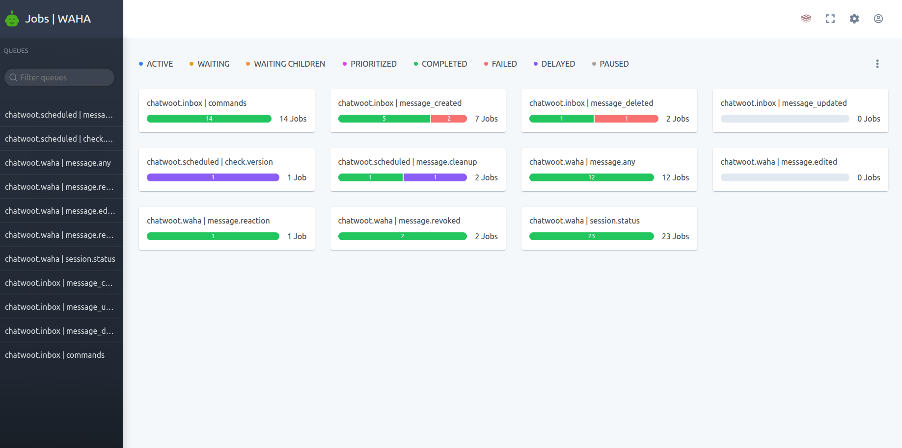

**🧩 Apps** are **built-in connections** that integrate **WAHA** with **other services** in a few steps.

**WAHA Team** fully supports **🧩 Apps**.



## Available Apps
Apps available to connect:
- [**ChatWoot**]() - use your **WhatsApp** in **ChatWoot CRM**

## Configuration



## How it works



You can use the **WAHA Jobs Dashboard** at [http://localhost:3000/jobs](http://localhost:3000/jobs) for monitoring **Worker** and it's jobs:

## Apps SDK

> This section is currently under development. Check back soon for detailed information about the integration architecture and workflow.
