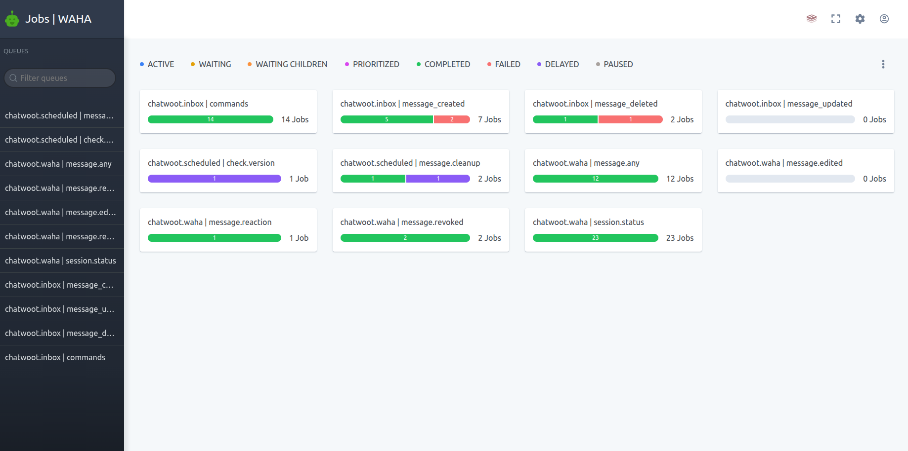

**🧩 Apps** are **built-in connections** that integrate **WAHA** with **other services** in a few steps.

**WAHA Team** fully supports **🧩 Apps**.



## Available Apps
Apps available to connect:
- [**ChatWoot**]() - use your **WhatsApp** in **ChatWoot CRM**
- [**Reject Calls**]() - automatically **reject calls** and **auto-reply with a message**
- [**MCP**]() - connect **AI agents** to **WhatsApp** with **granular permission scopes**
- [**Brazilian Phone Numbers**]() - resolve the **9th digit** in 🇧🇷 **Brazilian numbers** automatically

## Configuration



## API


You can fetch and update apps using [**🖥️ Sessions**]() API endpoints.


### List apps for a session
```http request
GET /api/apps?session={session}
```

### Create a new app
```http request
POST /api/apps
```

```json {title="Body"}
{
  "enabled": true,
  "id": "app_{id}",
  "session": "string",
  "app": "chatwoot", 
  "config": {}
}
```

- `id` - use **random long string** for `app: chatwoot` or **session name** for `app: calls`
- `config` - check the latest app config in [**📚 Swagger**]().
  - `ChatWootAppConfig` 
  - `CallsAppConfig`
  - `McpAppConfig`
  - `BrazilianPhoneNumbersAppConfig`

### Update an app
```http request
PUT /api/apps/{appId}
```

### Delete an app
```http request
DELETE /api/apps/{appId}
```

### Purge app storage
Delete the app's stored data (database rows, caches) while keeping the app configured.

```http request
POST /api/apps/{appId}/purge
```

For **unique** apps (one instance per session - like **ChatWoot**) you can purge by app name and session
(the app must be **enabled**):

```http request
POST /api/apps/{app}/{session}/purge
```

You can also purge apps' storage when [**logging out a session**]():

```http request
POST /api/sessions/{session}/logout
```

```jsonc {title="Body"}
{
  "apps": {
    "purge": true
  }
}
```

## How it works



You can use the **WAHA Jobs Dashboard** at [http://localhost:3000/jobs](http://localhost:3000/jobs) for monitoring **Worker** and it's jobs:

<div class="text-center">



</div>

## Apps SDK

> This section is currently under development. Check back soon for detailed information about the integration architecture and workflow.
