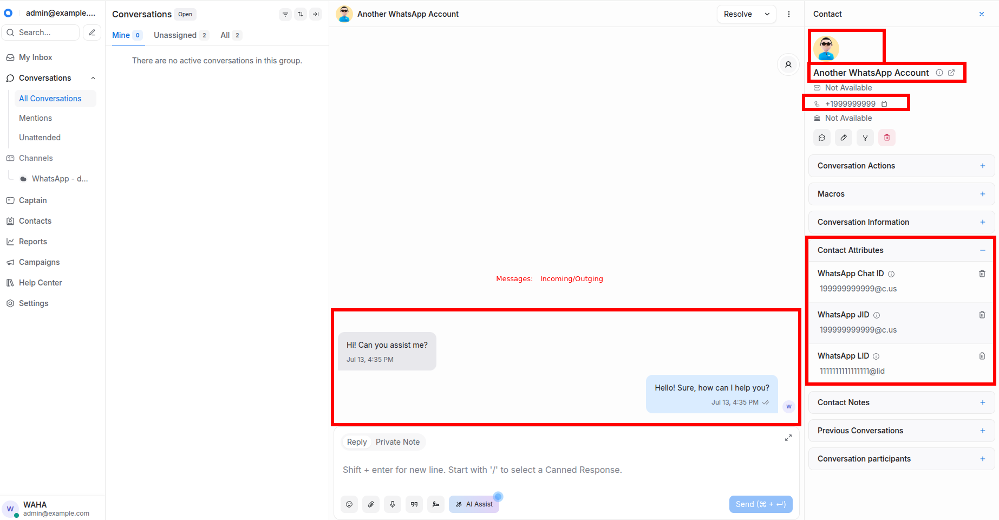

  

**WAHA** provides a built-in **WhatsApp** integration for
[**ChatWoot**](https://www.chatwoot.com/) you can configure in a few steps!



## Install
We cover all installation and configuration aspects in the series of articles


## How it works

WIP

## Features

WIP
