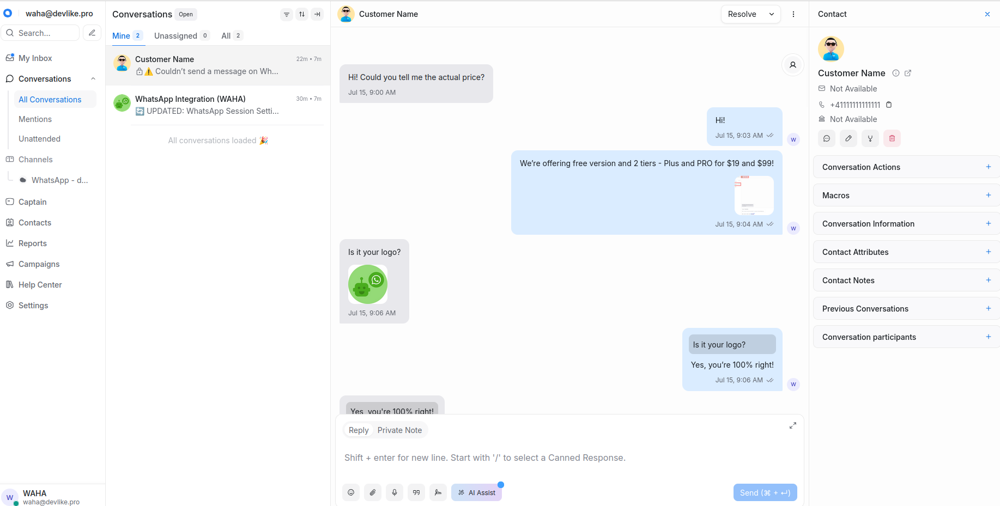
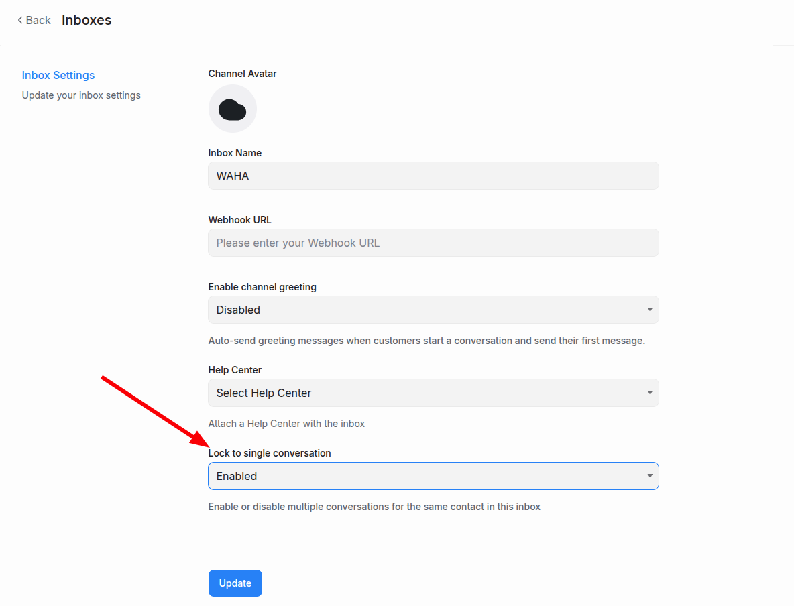
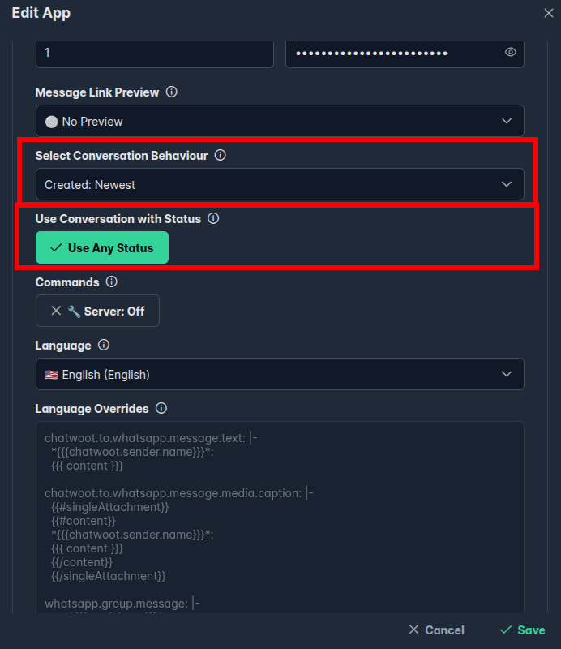
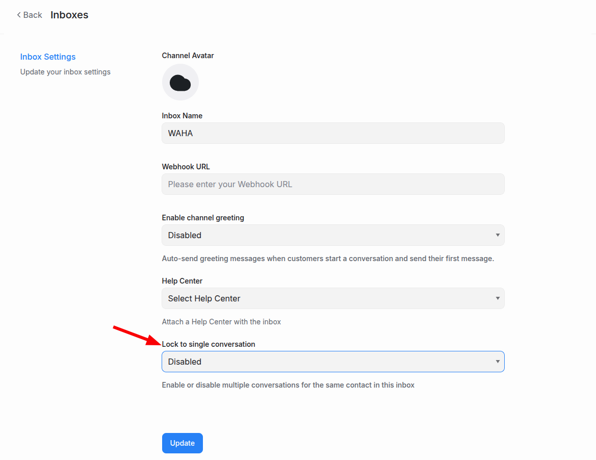
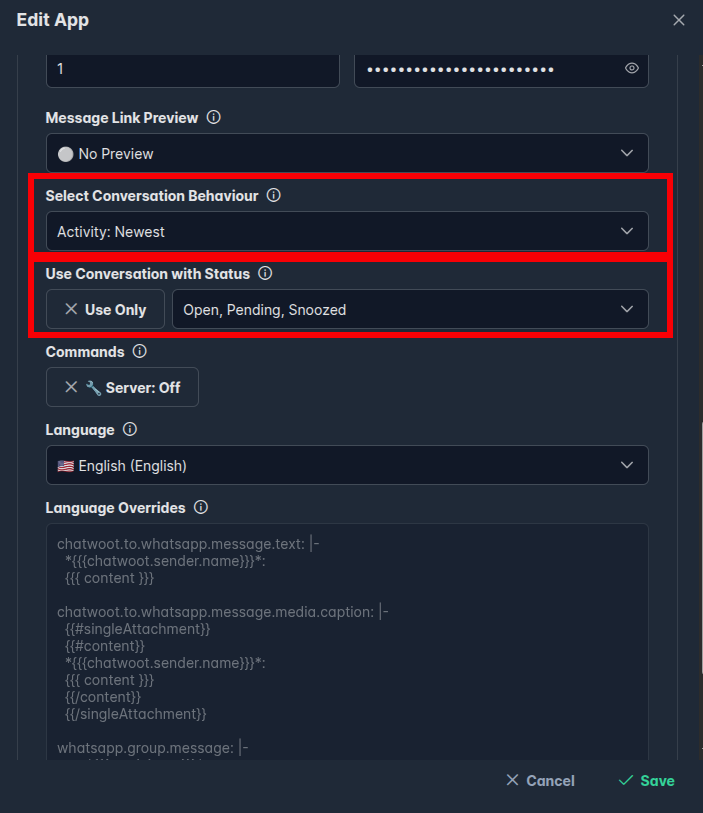
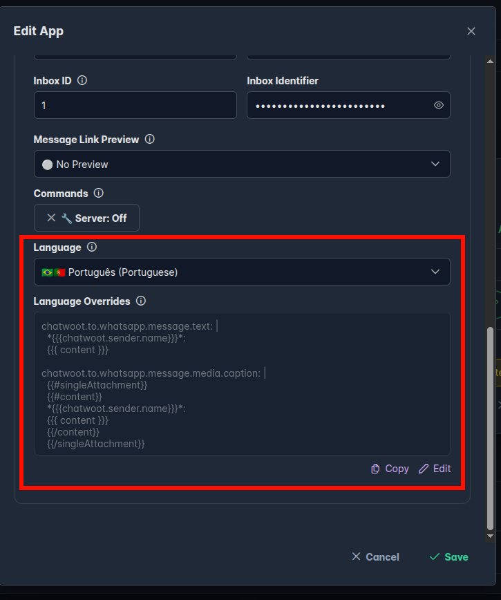
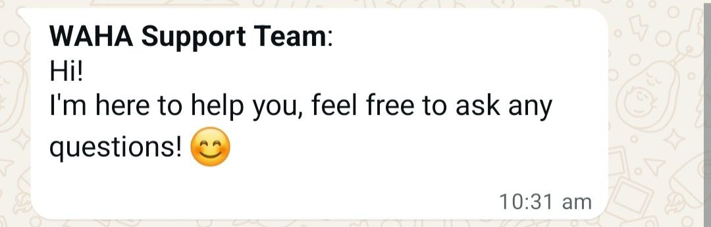
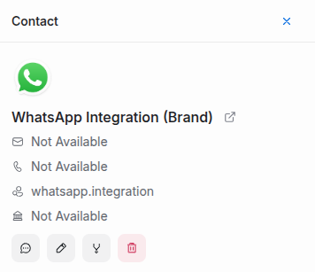
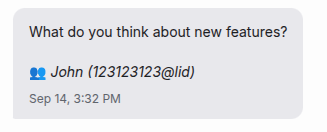
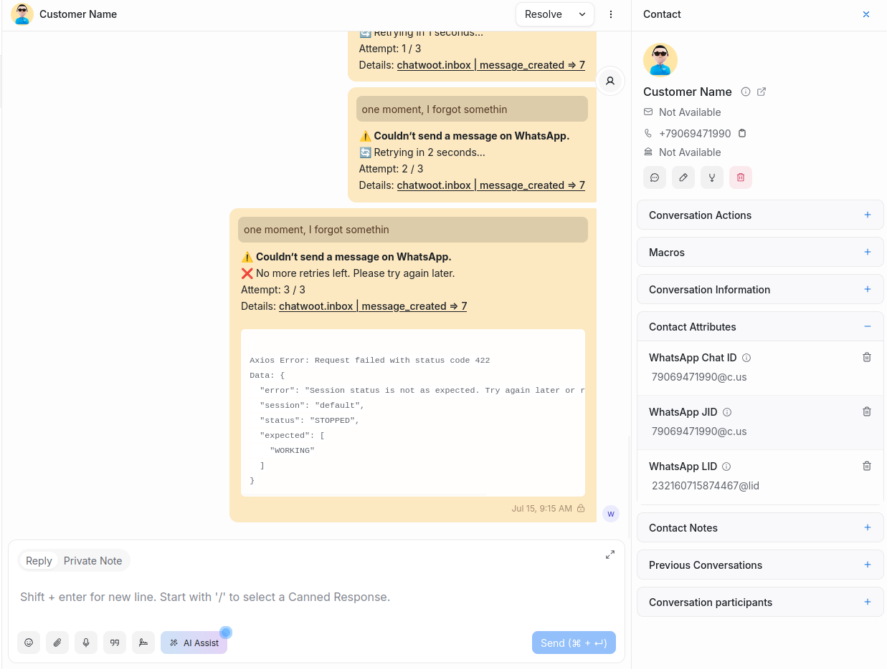

<p align="center">
  
</p>

**WAHA** includes a built-in **WhatsApp** integration for
[**Chatwoot**](https://www.chatwoot.com/). 


<br/><br/>




## Installation
We cover all installation and configuration aspects in the following series of articles:


## Configuration



## Conversations
You can map **WhatsApp** chats to **Chatwoot** conversations in two ways.
Your **Chatwoot** and **WAHA** settings **must be kept in sync**.

- **Single Conversation** — one ongoing thread per WhatsApp chat; new messages append to the same conversation (reopens if resolved).
- **Multiple Conversations** — agents resolve threads; the next incoming message creates a new conversation, allowing several per contact.

### Single Conversation
**One conversation** per WhatsApp chat (WhatsApp-like **behavior**). Each message goes
to a **single** conversation. Every contact in **Chatwoot** has only **one** open (or
resolved) conversation, and incoming WhatsApp messages are added to that
conversation (and **reopen** it if it’s closed).

Set in **Chatwoot**:
- **Inbox** - **Lock to single conversation** - **Enabled**



Set in **WAHA**:
- **Select conversation behavior** - **Created: Newest**
- **Use Conversation with Status** - **Use Any Status**



### Multiple Conversations
**Multiple conversations** per WhatsApp chat (Chatwoot’s **philosophy**).

A conversation remains active until an agent **resolves** it. After resolution,
a new incoming **message creates a new conversation**.

Set in **Chatwoot**:
- **Inbox** - **Lock to single conversation** - **Disabled**



Set in **WAHA**:
- **Select conversation behavior** - **Activity: Newest**
- **Use Conversation with Status** - **Use Only: Open, Pending, Snoozed**


If you set **Select conversation behavior** to **Activity: Newest**, **Chatwoot** treats conversation **status changes** as **activity**.




## Language
You can adjust **messages, templates, and branding** in the content WAHA sends to Chatwoot and WhatsApp
by providing key-value overrides in **YAML**.


You can find all languages and keys in the source code 
[**/src/apps/chatwoot/i18n/locales**](https://github.com/devlikeapro/waha/tree/core/src/apps/chatwoot/i18n/locales)


### Per-app Language Overrides
The easiest way to test or apply a few template overrides is to use the
[**📊 Dashboard**](), then set **Language Overrides**:



1. Copy a template from [**Language Templates**](#language-templates), or create your own template.
2. Save the app.
3. Test your changes.


### Global Language Overrides
If you want to **apply the overrides to all apps** or **add a new language**, you can do this globally.

In the steps below, we assume you installed WAHA using the
[**🔧 Install & Update**]() guide.

1. Create the `chatwoot-languages` directory and download the language file you want to modify (or use as a template for a new language):
```bash {title="Download Language"}
mkdir chatwoot-languages
cd chatwoot-languages
wget https://raw.githubusercontent.com/devlikeapro/waha/refs/heads/core/src/apps/chatwoot/i18n/locales/en-US.yaml
```

2. Decide what you want to do:
- To **add a new language** — **rename the file**
- To **make only a few changes to the default** — **keep the file name**
```bash {title="Rename File (only if adding a new language)"}
mv en-US.yaml company.yaml
```

3. Edit the file:
- If you are **adding a new language**, set a distinct `locale.name` and provide ALL keys
- If you are **overriding the default**, change only the desired keys and remove the rest

```bash {title="Change Templates"}
vim en-US.yaml
```

4. Update `docker-compose.yaml` to mount the folder with language overrides
```yaml {title="docker-compose.yaml"}
services:
  waha:
    restart: always
    image: devlikeapro/waha-plus
    volumes:
      - './sessions:/app/.sessions'
      - './media:/app/.media'
      - './chatwoot-languages:/app/.chatwoot-languages'  # 👈 Attaches the folder
    environment:
      - WAHA_APPS_CHATWOOT_LANGUAGES_FOLDER=/app/.chatwoot-languages  # 👈 Tells WAHA to use it as an additional languages folder
```

### Templates
Under the hood, WAHA uses the [Mustache](https://mustache.github.io/) template engine.

Below are template examples and the objects available to Mustache templates.


Used for any text message you send from Chatwoot to WhatsApp to render the content:

```yaml {title="chatwoot.to.whatsapp.message.text"}
chatwoot.to.whatsapp.message.text: |
    {{{ content }}}
```

- `content` - **text** from Chatwoot converted to WhatsApp Markdown

```json {title="content"}
"Here's the *bold* text"
```

- `chatwoot` - Chatwoot’s 
[**message_created | message_updated**](https://www.chatwoot.com/hc/user-guide/articles/1677693021-how-to-use-webhooks)
webhook payload

```json {title="chatwoot"}
{
  "event": "message_created",
  "message_type": "outgoing",
  "content_type": "text",
  "content": "Hi there!",
  "sender": {
    "id": 1,
    "name": "Agent Smith",
    "email": "smith@example.com",
    "type": "user"
  },
  "account": {
    "id": 1,
    "name": "admin@example.com"
  },
  "additional_attributes": {},
  "content_attributes": {},
  "conversation": {
    "additional_attributes": {},
    "can_reply": true,
    "channel": "Channel::Api",
    "contact_inbox": {
      "id": 5,
      "contact_id": 5,
      "inbox_id": 1,
      "source_id": "83b72ca2-9bfe-4fd5-AAAA-83e9c81938f1",
      "created_at": "2025-08-10T06:10:40.755Z",
      "updated_at": "2025-08-10T06:10:40.755Z",
      "hmac_verified": false,
      "pubsub_token": "AAAAA"
    },
    "id": 5,
    "inbox_id": 1,
    "messages": [
      {
        "id": 222,
        "content": "Hi there!",
        "account_id": 1,
        "inbox_id": 1,
        "conversation_id": 5,
        "message_type": 1,
        "created_at": 1757111864,
        "updated_at": "2025-08-10T10:41:04.660Z",
        "private": false,
        "status": "sent",
        "source_id": null,
        "content_type": "text",
        "content_attributes": {},
        "sender_type": "User",
        "sender_id": 1,
        "external_source_ids": {},
        "additional_attributes": {},
        "processed_message_content": "t",
        "sentiment": {},
        "conversation": {
          "assignee_id": 1,
          "unread_count": 0,
          "last_activity_at": 1757111864,
          "contact_inbox": {
            "source_id": "83b72ca2-aaaa-4fd5-9118-83e9c81938f1"
          }
        },
        "sender": {
          "id": 1,
          "name": "Agent",
          "available_name": "Agent",
          "avatar_url": "",
          "type": "user",
          "availability_status": null,
          "thumbnail": ""
        }
      }
    ],
    "labels": [],
    "meta": {
      "sender": {
        "additional_attributes": {},
        "custom_attributes": {
          "waha_whatsapp_jid": "11111111111@c.us",
          "waha_whatsapp_lid": "9999999999999@lid",
          "waha_whatsapp_chat_id": "11111111111@c.us"
        },
        "email": null,
        "id": 5,
        "identifier": null,
        "name": "Agent",
        "phone_number": "+11111111111",
        "thumbnail": "http://chatwoot:3009/rails/....",
        "blocked": false,
        "type": "contact"
      },
      "assignee": {
        "id": 1,
        "name": "Agent",
        "available_name": "Agent",
        "avatar_url": "",
        "type": "user",
        "availability_status": null,
        "thumbnail": ""
      },
      "team": null,
      "hmac_verified": false
    },
    "status": "open",
    "custom_attributes": {},
    "snoozed_until": null,
    "unread_count": 0,
    "first_reply_created_at": "2025-08-10T06:40:44.107Z",
    "priority": null,
    "waiting_since": 0,
    "agent_last_seen_at": 1757111864,
    "contact_last_seen_at": 0,
    "last_activity_at": 1757111864,
    "timestamp": 1757111864,
    "created_at": 1757111864,
    "updated_at": 1757111864.676595
  },
  "created_at": "2025-08-10T10:41:04.660Z",
  "id": 222,
  "inbox": {
    "id": 1,
    "name": "Agent"
  },
  "private": false,
  "source_id": null
}
```






Used for any media message you send from Chatwoot to WhatsApp to render the caption:

```yaml {title="chatwoot.to.whatsapp.message.media.caption"}
chatwoot.to.whatsapp.message.media.caption: |
  {{#singleAttachment}}
  {{#content}}
  {{{ content }}}
  {{/content}}
  {{/singleAttachment}}
```

- `content: string` - same as for `chatwoot.to.whatsapp.message.text`
- `chatwoot: object` - same as for `chatwoot.to.whatsapp.message.text`
- `singleAttachment: boolean` - flag indicating whether the Chatwoot message has a single attachment



## Language Templates
Below you will find **commonly used override patterns**.

### Add Agent Name
Prefix all **Chatwoot to WhatsApp** messages with the **agent name**.

<div class="text-center mb-2">
  
</div>

```yaml
chatwoot.to.whatsapp.message.text: |-
  *{{{chatwoot.sender.name}}}*:
  {{{ content }}}

chatwoot.to.whatsapp.message.media.caption: |-
  {{#singleAttachment}}
  {{#content}}
  *{{{chatwoot.sender.name}}}*:
  {{{ content }}}
  {{/content}}
  {{/singleAttachment}}
```

### Chatwoot Integration Contact
Customize how the default **WhatsApp Integration** contact appears in Chatwoot.

<div class="text-center mb-2">
  
</div>


If you already have WAHA connected to any Chatwoot inbox, this template does not retroactively update that
contact. It applies only when creating the first WAHA inbox in your Chatwoot account.

However, you can update the contact name and avatar directly in Chatwoot — WAHA searches for the contact by the
**WhatsApp Chat ID** attribute, which should be `whatsapp.integration`.


```yaml
app.inbox.contact.name: |-
  WhatsApp Integration (Brand)

app.inbox.contact.avatar.url: |-
  https://upload.wikimedia.org/wikipedia/commons/5/5e/WhatsApp_icon.png
```

### Group Participant At The Bottom
You can move the "participant" part to the bottom in group chat messages

<div class="text-center mb-2">
  
</div>

```yaml
whatsapp.group.message: |-
  {{{text}}}
  
  👥 *{{{participant}}}*
```

## How it works



### Error Handling
In case of any errors, WAHA retries a few times and then gives detailed information about the error:



You can use the **WAHA Jobs Dashboard** at [http://localhost:3000/jobs](http://localhost:3000/jobs) for monitoring:


