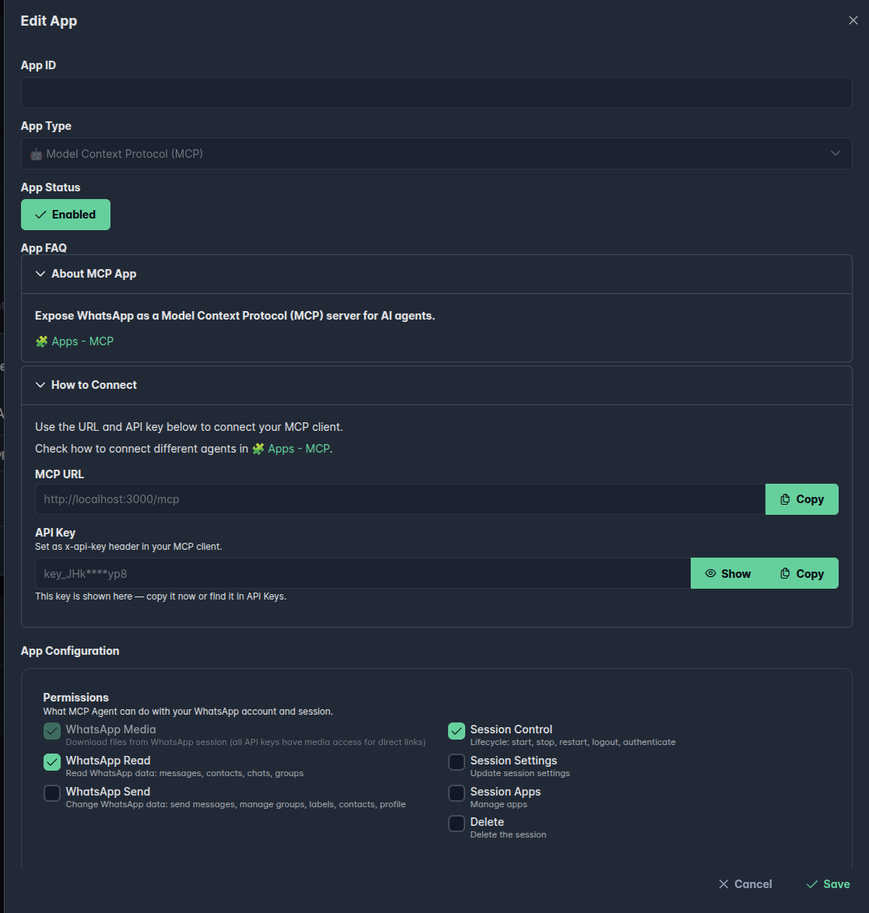

<p align="center">
  
</p>

**WAHA MCP** turns your **self-hosted** WAHA instance into a
[Model Context Protocol](https://modelcontextprotocol.io/) server.




Any MCP-compatible AI agent — Claude, Goose, OpenClaw, and others — can send messages,
read chats, and manage contacts through your own infrastructure,
with **granular permission scopes** so you decide exactly what the agent is allowed to do.



Connecting an AI agent to WhatsApp gives it access to **private conversations**.
Researchers have demonstrated **tool-poisoning attacks** where a malicious MCP server injects hidden instructions that silently redirect your outgoing messages — along with your full chat history — to an attacker's number.

Read: [MCP Horror Stories: The WhatsApp Data Exfiltration Attack](https://www.docker.com/blog/mcp-horror-stories-whatsapp-data-exfiltration-issue/) (Docker, Nov 2025)

**How to reduce the risk with WAHA:**
- Create a **dedicated MCP app** per session — never reuse your admin key
- Grant only the [scopes](#permissions) the agent actually needs (e.g. `send` only, no `read`)
- Revoke or disable the app's API key when the agent is not in use
- Run WAHA on a private network, not exposed to the internet



MCP is a **🧩 App** — you create one MCP app per WhatsApp session.
Each app gets its own scoped API key, so you control exactly what the AI agent is allowed to do.


## Requirements

New in WAHA? Go over [**⚡ Quick Start**]() first.

Enable Apps in your WAHA configuration:

```bash {title=".env"}
WAHA_APPS_ENABLED=True
WAHA_API_KEY=yoursecretkey
```

See [**🧩 Apps**]() for all available configuration options.

## Setup

Run WAHA with Apps enabled and your sessions folder mounted:

```bash
docker run -it \
  -e WAHA_APPS_ENABLED=True \
  -e WAHA_API_KEY=yoursecretkey \
  -v ./sessions:/app/.sessions \
  -p 3000:3000 \
  devlikeapro/waha-plus
```


This is the minimum setup to get started.
Check out the [**🔧 Install & Update**]() guide on how to configure it for production.


Create an **MCP App** for the session you want to expose.
WAHA automatically generates a scoped API key for that session — copy it from the app details to use in your MCP client.

### Dashboard

Open the [**📊 Dashboard**](), navigate to your session's **Apps** tab, and create a new MCP app.
Set the [permissions](#permissions) you want to grant the AI agent.

<p align="center">
  
</p>

### API

```http request
POST /api/apps
```

```jsonc {title="Body"}
{
  "enabled": true,
  "id": "app_mcp_default",
  "session": "default",
  "app": "mcp",
  "config": {
    "actions": {
      "read": true,
      "send": true,
      "control": false,
      "setting": false,
      "app": false,
      "delete": false
    }
  }
}
```

The response includes the generated API key in `config.key` — save it for your client configuration.

```jsonc {title="Response"}
{
  "id": "app_mcp_default",
  "session": "default",
  "app": "mcp",
  "enabled": true,
  "config": {
    "key_id": "key_id_00000000000000000000000000",
    "key": "key_11111111111AAAAAAAAAAAAAAAAAAAAA",
    "actions": {
      "read": true,
      "send": true,
      "control": false,
      "setting": false,
      "app": false,
      "delete": false
    }
  }
}
```

## Connect

The MCP server is available at:

```bash
http://localhost:3000/mcp
```

Pass your API key as an HTTP header in your MCP client configuration:

```http request {title="Headers"}
X-Api-Key: YOUR_KEY
```


**[➕ WAHA Plus]()** — use the key generated by the **MCP App** (see [Setup](#setup) above).
The app auto-generates a scoped API key, so you control exactly what the AI agent can do.

**WAHA Core** — use your `WAHA_API_KEY` environment variable directly.
There is no way to limit the AI agent's permissions in Core; it will have full access to the API.


### Claude Code

```bash
claude mcp add --transport http whatsapp http://localhost:3000/mcp \
  --header "X-Api-Key: YOUR_KEY"
```

### Claude Desktop

Add to your `claude_desktop_config.json`:

```json {title="claude_desktop_config.json"}
{
  "mcpServers": {
    "whatsapp": {
      "command": "npx",
      "args": [
        "mcp-remote",
        "http://localhost:3000/mcp",
        "--header",
        "X-Api-Key:YOUR_KEY"
      ]
    }
  }
}
```

### Goose

Run `goose configure` in your terminal and walk through the prompts:

```text {title="goose configure"}
What would you like to configure?        → Add Extension
What type of extension?                  → Remote Extension (Streamable HTTP)
What would you like to call it?          → whatsapp
Streamable HTTP endpoint URI?            → http://localhost:3000/mcp
Timeout (in secs)?                       → 300
Enter a description                      → WhatsApp MCP
Add custom headers?                      → Yes
Header name:                             → X-Api-Key
Header value:                            → YOUR_KEY
Add another header?                      → No
```

In the desktop app the same flow lives under **Settings → Extensions → Add custom extension**.
Goose stores extensions in `~/.config/goose/config.yaml` so you can also edit that directly.

### OpenClaw

Add your server under `mcp.servers` in `openclaw.json`
(typically `~/.openclaw/openclaw.json`):

```json {title="openclaw.json"}
{
  "mcp": {
    "servers": {
      "whatsapp": {
        "url": "http://localhost:3000/mcp",
        "transport": "streamable-http",
        "connectionTimeoutMs": 10000,
        "headers": {
          "X-Api-Key": "YOUR_KEY"
        }
      }
    }
  }
}
```

Use `transport: "streamable-http"` (OpenClaw's canonical spelling).
You can also manage entries with `openclaw mcp set` / `openclaw mcp list`.
If the server doesn't appear, run `openclaw gateway restart`.

## Permissions

The `actions` field controls what the AI agent can do within the session.
Set only the scopes you actually need — the key principle is **least privilege**.


**Media files are accessible with any key**, regardless of scopes.
All session keys can download media from `/api/files/` — see [**Use ?x-api-key query parameter**]() for embedding media in HTML.


| Scope | Description |
|-------|-------------|
| `read` | Read chats, messages, contacts, groups, etc. |
| `send` | Send messages, manage groups, labels, channels, contacts, profile |
| `control` | Start, stop, restart, logout, authenticate the session |
| `setting` | Update session settings |
| `app` | Manage apps |
| `delete` | Delete the session |

A typical **read + send only** setup (good for a messaging assistant):

```jsonc
"actions": {
  "read": true,
  "send": true,
  "control": false,
  "setting": false,
  "app": false,
  "delete": false
}
```

Read more about scopes in [**🔒 Session Key Scopes**]().

## Examples





