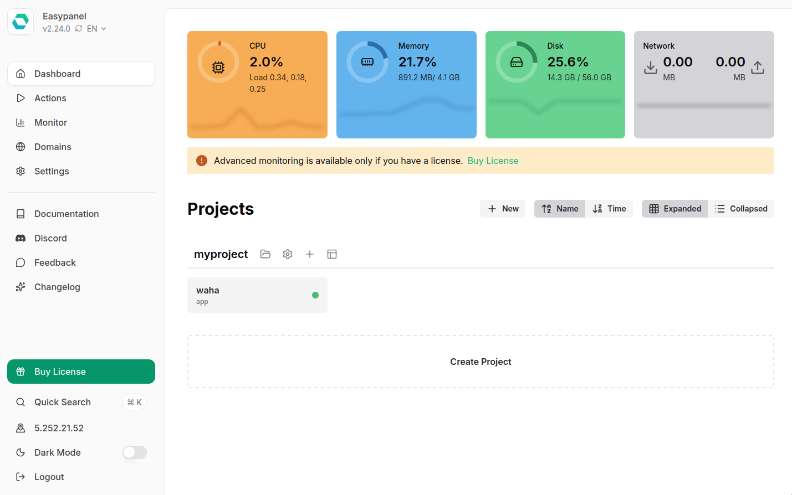
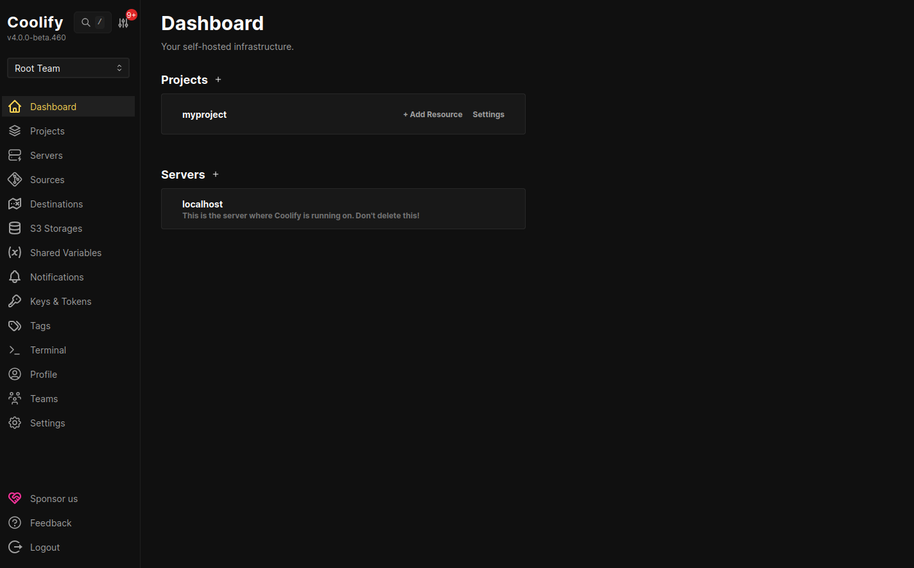

You probably already have run the docker run command during
[**⚡ Quick Start**]() guide:
```bash
docker run ... devlikeapro/waha
```


☝️ The above command is good **for development purposes**, but **not for production**.


To make it **production-ready**, you need to configure a few more parameters to make it secure, reliable, and easy to manage. 💪🏻


## Why Self-Host WAHA?

Self-hosting WAHA gives you complete control over your privacy:

- **Data Privacy**: Keep all data on your own servers
- **Cost Control**: No per-session/per-message pricing - scale as much as you need
- **Integration**: Deep integration with your existing infrastructure

## Install

WAHA supports 
[**multiple deployment methods**]()
to fit different infrastructure needs.

All options are containerized - choose based on **how you want to manage it**.

<hr>

### Docker

<div class="text-center" style="margin-bottom: 16px;">
  
</div>

Use **Docker** and **Docker Compose** for consistent, portable deployments.



```yaml {title="docker-compose.yaml"}
services:
  waha:
    image: devlikeapro/waha
    restart: always
    ports:
      - "3000:3000"
    volumes:
      - ./.sessions:/app/.sessions
    # ...
```

- **Management**: CLI and Compose files 🟠
- **Complexity**: Medium 🟠
- **Maintenance**: Command line to pull image and restart  🟠
- **Flexibility**: Full control over configuration and scaling 🟢
- **Cons**: You own uptime, backups, and monitoring; updates are manual 🔴

<hr>

### EasyPanel

<div class="text-center" style="margin-bottom: 16px;">
  
</div>

Use an intuitive [**EasyPanel**](https://easypanel.io/) interface to deploy, manage, and provision SSL certificates.





- **Management**: UI (point-and-click) 🟢
- **Complexity**: Low 🟢
- **Maintenance**: One-click updates, SSL, and monitoring from the panel 🟢
- **Flexibility**: Less control over low-level settings 🟠
- **Cons**: Not open source, paid for more than 3 projects 🔴

<hr>

### Coolify

<div class="text-center" style="margin-bottom: 16px;">
  
</div>

[**Coolify**](https://coolify.io/) is an open-source & self-hostable alternative to Vercel and co for easily deploying services to your own server.





- **Management**: UI (self-hosted) 🟢
- **Complexity**: Low 🟢
- **Maintenance**: Panel-driven updates and monitoring 🟢
- **Flexibility**: Less control over low-level settings 🟠
- **Cons**: More developer-focused panel 🔴

<hr>

### ChatWoot

If you want to use
[**🧩 Apps**](), such as
[**ChatWoot**](),
please follow the specific installation and configuration guides provided for each app:



<hr>

## Update



## What's next?


