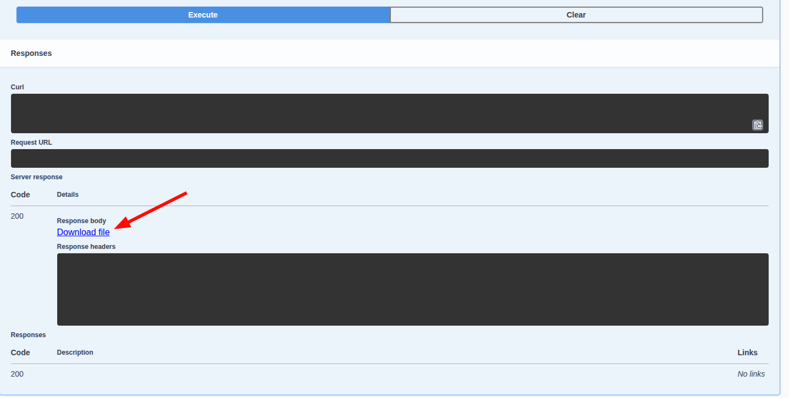

## Logging

Options you can use to control how WAHA outputs logs:

- `WAHA_LOG_FORMAT` - supports formats:
    - `WAHA_LOG_FORMAT=PRETTY` - good for local development, **default** format
    - `WAHA_LOG_FORMAT=JSON` - can be useful if you're using a central logging management system
- `WAHA_LOG_LEVEL` - how much information to log `error | warn | info | debug | trace`.
    - 👉 Do not set `debug` and `trace` in production, as these levels generate excessive log output.
- `WAHA_HTTP_LOG_LEVEL=info` - controls the level of `request completed` log (HTTP access). You can set it
  to `error | warn | info | debug | trace`.
- `DEBUG=1` - you can set this environment variable as a shortcut for `WAHA_LOG_LEVEL=debug`, `DEBUG=1` overrides
  the `WAHA_LOG_LEVEL` to `debug` if both defined.

### Session logging

You can enable debug mode for a session by setting the `config.debug` field to `true` when 
[Starting a session]()

This can be useful for debugging purposes when you're experiencing issues.

```json
{
  "name": "default",
  "config": {
    "debug": true
  }
}
```

## Ping

Returns a simple response to check if the service is running.

```http request
GET /ping
```

```json
{
  "message": "pong"
}
```

## Get server version

Returns the version of the installed docker image.

```http request
GET /api/server/version
```

```json
{
  "version": "2024.2.3",
  "engine": "NOWEB",
  "tier": "PLUS",
  "browser": "/usr/bin/google-chrome-stable"
}
```

## Get server environment variables

Returns the environment variables of the server.

This endpoint returns only WAHA-related variables:

```http request
GET /api/server/environment?all=false
```

```json
{
  "DEBUG": "1",
  "WAHA_HTTP_LOG_LEVEL": "debug",
  "WAHA_LOG_FORMAT": "PRETTY",
  ...
}

```

To return all environment variables:

```http request
GET /api/server/environment?all=true
```

```json
{
  "DEBUG": "1",
  "WAHA_HTTP_LOG_LEVEL": "debug",
  "WAHA_LOG_FORMAT": "PRETTY",
  "PATH": "/home/...",
  ...
}

```

## Get server status

Returns the server status, start timestamp, and uptime.

```http request
GET /api/server/status
```

```json
{
  "startTimestamp": 1723788847247,
  "uptime": 3600000
}
```

## Restart (stop) server

You can stop the server by calling:

```http request
POST /api/server/stop
```

```json
{
  // By default, it gracefully stops all sessions and connections,
  // but you can force it to stop immediately
  "force": false
}
```
👉 If you're using Docker and followed the [**🔧 Install & Update**]() guide,
Docker will **automatically restart** the server, so you can use this endpoint to **reboot** the service.


## Health Check

<b>Health check is available in [WAHA Plus ]()
only.</b>

The health check endpoint is used to determine the health of the service.

```http request
GET /health
```

It returns a **200 OK** status code if the service is healthy.

The response format:

```json
{
  "status": "ok",
  "info": {
    "metric1": {
      "field": "value"
    },
    "metric2": {
      "field": "value"
    }
  },
  "error": {},
  "details": {}
}
```

Where:

- `status`: `'error' | 'ok' | 'shutting_down'` - If any health indicator failed the status will be `'error'`. If the app
  is shutting down but still accepting HTTP requests, the health check will have the `'shutting_down'` status.
- `info`: Object containing information of each health indicator which is of status `'up'`, or in other words "healthy".
- `error`: Object containing information of each health indicator which is of status `'down'`, or in other words "
  unhealthy".
- `details`: Object containing detailed information of each health indicator.

### Health Check Indicators

The health check monitors the following components:

- Media files storage space - `mediaFiles.space`
- Sessions files storage space - `sessionsFiles.space`
- MongoDB connection - `mongodb`

### Configuration

The following environment variables can be used to configure the health check:

- `WHATSAPP_HEALTH_MEDIA_FILES_THRESHOLD_MB` - the threshold in MB for the media files storage. The default value
  is `100`.
- `WHATSAPP_HEALTH_SESSIONS_FILES_THRESHOLD_MB` - the threshold in MB for the sessions files storage. The default value
  is `100`.
- `WHATSAPP_HEALTH_MONGODB_TIMEOUT` - the timeout in milliseconds for the MongoDB health check. The default value
  is `5000`.

### Examples

**Healthy response** when you use [Local Storage]() for session
authentication:

**200 OK**

```json
{
  "status": "ok",
  "info": {
    "mediaFiles.space": {
      "status": "up",
      "path": "/tmp/whatsapp-files",
      "diskPath": "/",
      "free": 132979355648,
      "threshold": 104857600
    },
    "sessionsFiles.space": {
      "status": "up",
      "path": "/app/.sessions",
      "diskPath": "/",
      "free": 132979355648,
      "threshold": 104857600
    }
  },
  "error": {},
  "details": {
    "mediaFiles.space": {
      "status": "up",
      "path": "/tmp/whatsapp-files",
      "diskPath": "/",
      "free": 132979355648,
      "threshold": 104857600
    },
    "sessionsFiles.space": {
      "status": "up",
      "path": "/app/.sessions",
      "diskPath": "/",
      "free": 132979355648,
      "threshold": 104857600
    }
  }
}
```

**Healthy response** when you use [MongoDB Storage]() for session
authentication:

**200 OK**

```json
{
  "status": "ok",
  "info": {
    "mediaFiles.space": {
      "status": "up",
      "path": "/tmp/whatsapp-files",
      "diskPath": "/",
      "free": 132977496064,
      "threshold": 104857600
    },
    "mongodb": {
      "status": "up",
      "message": "Up and running"
    }
  },
  "error": {},
  "details": {
    "mediaFiles.space": {
      "status": "up",
      "path": "/tmp/whatsapp-files",
      "diskPath": "/",
      "free": 132977496064,
      "threshold": 104857600
    },
    "mongodb": {
      "status": "up",
      "message": "Up and running"
    }
  }
}
```

**Unhealthy response example**

**503 Service Unavailable**

```json
{
  "status": "error",
  "info": {
    "mediaFiles.space": {
      "status": "up",
      "path": "/tmp/whatsapp-files",
      "diskPath": "/",
      "free": 132976623616,
      "threshold": 104857600
    }
  },
  "error": {
    "mongodb": {
      "status": "down",
      "error": "Timeout"
    }
  },
  "details": {
    "mediaFiles.space": {
      "status": "up",
      "path": "/tmp/whatsapp-files",
      "diskPath": "/",
      "free": 132976623616,
      "threshold": 104857600
    },
    "mongodb": {
      "status": "down",
      "error": "Timeout"
    }
  }
}
```

## Troubleshooting
There's few internal tools to help us (as developers) understand what it's going on under the hood.
The below section you can use if you have any problem, and we asked to collect additional information.

### Enable Debug Mode
By default, debug mode is off. 

Enable it by adding `WAHA_DEBUG_MODE` environment variable:
```bash
WAHA_DEBUG_MODE=True
```

### ALL - node heapsnapshot

Works with all engines: **WEBJS**, **GOWS**, **NOWEB**


- Add `WAHA_DEBUG_MODE=True` env variable
- Restart container
- Execute request (only when the issue's happening to collect the most recent information)

```http request
GET /api/server/debug/heapsnapshot
```

- Send the file to the developers or open `about://inspect` in Chrome to analyze the heap

You can execute request in
[**📚 Swagger**](),
then click on **Download File**:



### ALL - node cpu profiling

Works with all engines: **WEBJS**, **GOWS**, **NOWEB**


- Add `WAHA_DEBUG_MODE=True` env variable
- Restart container
- Execute request (only when the issue's happening to collect the most recent information)

```http request
GET /api/server/debug/cpu?seconds=30
```

- Send the file to the developers or open `about://inspect` in Chrome to analyze the profile

### WEBJS - Get Browser Trace

Works only with **WEBJS** engine


- Add `WAHA_DEBUG_MODE=True` env variable
- Restart container
- Execute request (only when the issue's happening to collect the most recent information)

```http request
GET /api/server/debug/browser/trace/{SESSION}?seconds=30&categories=%2A
```
Get **browser's trace** (uses [puppeteer](https://pptr.dev/api/puppeteer.tracing))
which you can open in Chrome Dev Tool
([chrome://tracing](chrome://tracing))
or 
[https://trace.cafe/](https://trace.cafe/).

**Query Parameters:**
- `seconds` - how many seconds to trace
- `categories` - categories to trace


- 👉 Only one trace can be active at a time per browser.
- ⌛ It takes `SECONDS` seconds to generate the trace file, please be patient 🐢


You can execute request in
[**📚 Swagger**](),
then click on **Download File**:


### GOWS - pprof

Works only with **GOWS** engine


- Add `WAHA_DEBUG_MODE=True` env variable
- Expose `6060` port from the docker (see yaml below)

```yaml {title="docker-compose.yaml"}
services:
  waha:
    image: devlikeapro/waha-plus
    ports:
      - "127.0.0.1:6060:6060"
```

- Restart container
- Use `curl` to collect heap when issue is happening

```bash {title="Download heap"}
curl -s http://localhost:6060/debug/pprof/heap > heap.pb.gz
```
- Send `heap.pb.gz` to developers or analyze it using

```bash {title="Check your heap"}
go tool pprof -http=:8081 ./heap.pb.gz
```

- **OR** you can connect and debug it online using built-in http server:

```bash {title="Connect to pprof"}
go tool pprof -http=:8081 http://localhost:6060/debug/pprof/heap
```

