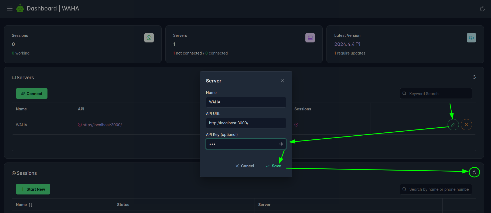


We do not recommend exposing the API on any public networks!

Always protect the API with [**Api Key**](#api-security) and deny access by using firewalls.



## API security

You can protect the API by requiring `X-Api-Key` header in HTTP request. 

You can use `WAHA_API_KEY` environment variable. It accepts two formats:

- `WAHA_API_KEY=sha512:{SHA512_HEX_HASH}`: require `X-Api-Key: {PLAIN_KEY}` header in all requests to the API. This is the **recommended** format as it stores only the hash of your key in the environment variables, making it more secure if your environment variables are exposed.
- `WAHA_API_KEY={PLAIN_KEY}`: require `X-Api-Key: {PLAIN_KEY}` header in all requests to the API. This format stores your key in plain text in the environment variables, which is less secure.

### Generate and Hash Api-Key


### Set Api-Key Hash
Set
`WAHA_API_KEY=sha512:{SHA512_HEX_HASH}` in docker (or in `docker-compose.yaml` or `.env`):

```bash
docker run -it -e WAHA_API_KEY=sha512:98b6d128682e280b74b324ca82a6bae6e8a3f7174e0605bfd52eb9948fad8984854ec08f7652f32055c4a9f12b69add4850481d9503a7f2225501671d6124648 devlikeapro/waha-plus
```

Test API works as expected
```bash
# No Key
curl http://localhost:3000/api/sessions
> {"message":"Unauthorized","statusCode":401}

# Wrong Key
curl -H 'X-Api-Key: othersecret' http://localhost:3000/api/sessions
> {"message":"Unauthorized","statusCode":401}

# Right Key
curl -H 'X-Api-Key: 00000000000000000000000000000000' http://localhost:3000/api/sessions
> []
```

### Use Api-Key in Dashboard



### Use Api-Key in Swagger

After you set Api Key - to authorize on swagger, use the **Authorize** button at the top:


### Use X-Api-Key in HTTP request

To authorize requests - set `X-Api-Key` header to `yoursecretkey` for all requests that go to WAHA.




### Exclude endpoints
If you need to exclude some endpoints (like `GET /health` or `GET /ping`) from the API Key requirement - you can
set `WAHA_API_KEY_EXCLUDE_PATH` environment variable with a comma-separated list of endpoints (no `/` at the beginning).

```bash
docker run -it \
 -e WAHA_API_KEY_EXCLUDE_PATH="health,ping" \
 -e WAHA_API_KEY=yoursecretkey \
 devlikeapro/waha-plus
```


## Swagger Security
If you want to hide the project Swagger panel under the password - run the following command to hide under `admin/admin`
login and password.

```bash
docker run -it -e WHATSAPP_SWAGGER_USERNAME=admin123 -e WHATSAPP_SWAGGER_PASSWORD=admin123 devlikeapro/waha-plus
```

Open http://localhost:3000/ and enter `admin123 / admin123` in the inputs:



Protecting Swagger under the password does not protect your API from other request! Use both techniques to protect your API and Swagger!


Environment variables:
- `WHATSAPP_SWAGGER_ENABLED=true`: Toggle to enable or disable the Swagger.
- `WHATSAPP_SWAGGER_USERNAME=admin`
- `WHATSAPP_SWAGGER_PASSWORD=admin`
  Swagger panel with `admin / admin` credentials. This does not affect API access.


You can also set [**Swagger White Label**]()
options instead of hiding the Swagger panel.



## Dashboard Security
Read more about [**📊 Dashboard**]()

When running WAHA you can set the following environment variables to configure the dashboard:
- `WAHA_DASHBOARD_ENABLED=true` - enable or disable the dashboard, by default `true`. Set to `false` to disable the dashboard.
- `WAHA_DASHBOARD_USERNAME=waha` - username used to log in, by default `admin` or `waha` 
- `WAHA_DASHBOARD_PASSWORD=waha` - password used to log in, generated random.


## Webhook security
To make sure that you get a webhook from your WAHA instance - you can use **HMAC authentication**.

Read more about
[**🔄 Events**]().

## HTTPS
After you set up the security options - you should set up HTTPS to protect the data in transit and prevent [Man-in-the-middle attacks](https://en.wikipedia.org/wiki/Man-in-the-middle_attack).

That's fine to run it on the **local network** without HTTPS, but for **the production** environment, HTTPS is a must-have.



WAHA supports HTTPS out of the box if you don't want to use a reverse proxy like Nginx (**using Nginx is recommended**)

You can set up the following environment variables to enable HTTPS:
- `WAHA_HTTPS_ENABLED=true`: Set this variable to `true` to enable HTTPS. By default, it's `false`.
- `WAHA_HTTPS_PATH_KEY=/path/to/key.pem`: The path to the key file for HTTPS. By default `./.secrets/privkey.pem`
- `WAHA_HTTPS_PATH_CERT=/path/to/cert.pem`: The path to the certificate file for HTTPS. By default `./.secrets/cert.pem`
- `WAHA_HTTPS_PATH_CA=/path/to/ca.pem`: The path to the CA file for HTTPS. By default `./.secrets/chain.pem`

## FAQ
### How To Disable Security?
By default, WAHA checks those variables and if it's not set - generates a random one (check your console/logs output):
- `WAHA_API_KEY`
- `WAHA_DASHBOARD_PASSWORD`
- `WHATSAPP_SWAGGER_PASSWORD`

Even if you set this to "" (empty string) or "admin/waha/123"  - WAHA generates a new value.

If you **100% know what you are doing** - you can disable this explicilty and set to `.env` file:
```bash
# Api Key - Off
WAHA_API_KEY=
WAHA_NO_API_KEY=True
# Dashboard - Auth Off
WAHA_DASHBOARD_PASSWORD=
WAHA_DASHBOARD_NO_PASSWORD=True
# Swagger - Auth Off
WHATSAPP_SWAGGER_PASSWORD=
WHATSAPP_SWAGGER_NO_PASSWORD=True
```
