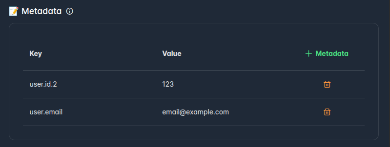
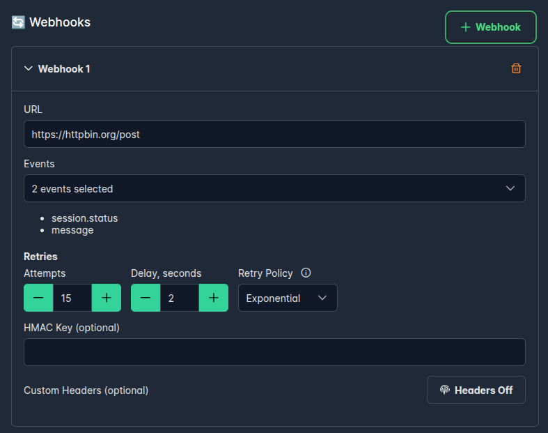
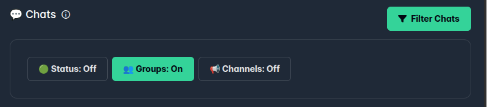
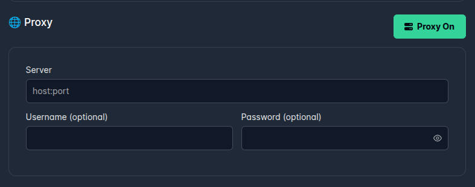
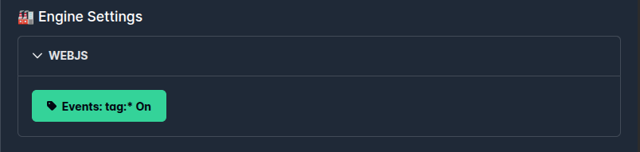
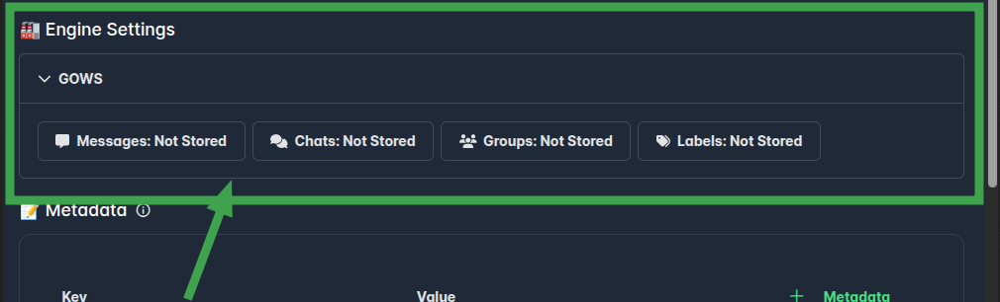
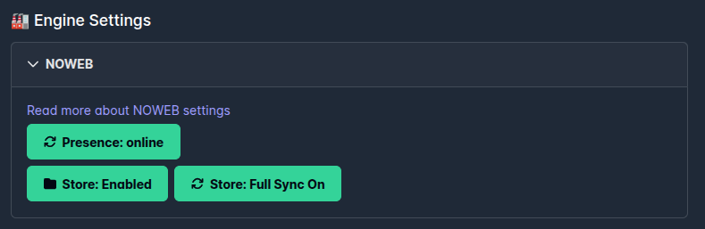

**Session** represents a **WhatsApp Account (Phone Number)** connected to **WAHA**
that you can use to send and receive messages.

## Features

Here's the list of features that are available by [**🏭 Engines**]():





## Session Lifecycle

Before you can
[**📤 Send**]()
or
[**📥 Receive**]()
messages
, you need to [**Create**](#create-session) a session (optionally, [**Start**](#start-session)) and authenticate it using
[**QR code**](#get-qr) or [**pairing code**](#get-pairing-code).

Here's Session Lifecycle State Diagram:




### Session Status

Here's the list of possible `session.status` values:

- `STOPPED` - session is stopped
- `STARTING` - session is starting
- `SCAN_QR_CODE` - session is required to scan QR code or login via phone number.
    - The `SCAN_QR_CODE` is issued every time when QR updated (WhatsApp requirements)
    - Every time you receive the `session.status` event with `SCAN_QR_CODE` status,
      you need to [**fetch updated QR ->**](), because it's changed.
- `PASSKEY_REQUIRED` - WhatsApp asks for a passkey (WebAuthn) to finish pairing.
    - The event payload's `data` field contains the challenge to sign,
      see [**🔑 Passkey ->**](#passkey).
- `PASSKEY_CONFIRMATION_REQUIRED` - the user must check a code before the pairing completes.
    - The event payload's `data` field contains the `code`,
      see [**🔑 Passkey ->**](#passkey).
    - Most pairings never reach this status - WhatsApp confirms them on its own.
- `WORKING` - session is working and ready to use
- `FAILED` - session is failed due to some error. It's likely either authorization is required again or device has been
  disconnected from that account. 

In `FAILED` status try to [**Restart**](#restart-session) the session and if it doesn't help - [**Logout**](#logout-session) and [**Start**](#start-session) the session again.


## Create Session

In order to create (and start) a new session - with [**Session Config**](#session-config).

```http request
POST /api/sessions
```

```jsonc { title="Body" }
{
  // "name" is Optional - it'll be generated automatically
  "name": "default",
  "config": {
    // Read about Session Config below
      ...
  }
}
```

```jsonc { title="Response" }
{
  "name": "session_123123123",
  // if name is not provided - it'll be generated automatically
  "status": "STARTING",
  "engine": {
    "engine": "WEBJS"
  },
  "config": {
    ...
  },
  "me": null
}
```

Here's how you can call it from various languages:



**WAHA** uses session `name` more like "id", but we call it `name` for historical and compatibility reasons.


### Postpone start

By default, the session starts right after creation.
You can create a session and postpone its start by setting `start` field to `false`.
It'll create a session in `STOPPED` status, and you can start it later by calling `POST /api/sessions/{session}/start`.

```jsonc { title="Body" }
{
  "name": "default",
  "start": false
}

```

## Session Config
**Full possible config** for a session:

```jsonc
{
  "name": "default",
  "config": {
    "debug": true,
    // Only for NOWEB engine
    "noweb": {
      "store": {
        "enabled": true,
        "fullSync": false
      }
    },
    // Only for WEBJS engine
    "webjs": {
      "tagsEventsOn": false
    },
    // Device name in WhatsApp -> Linked Devices
    "client": {
      "deviceName": "TEST",
      "browserName": "Chrome"
    },
    // Use "metadata" to save additional information.
    "metadata": {
      "user.id": "123",
      "user.email": "email@example.com"
    },
    "ignore": {
      "status": false,
      "groups": false,
      "channels": false
    },
    "webhooks": [
      {
        "url": "https://webhook.site/11111111-1111-1111-1111-11111111",
        "events": [
          "message"
        ],
        // Optional
        "hmac": {
          "key": "your-secret-key"
        },
        // Optional
        "customHeaders": [
          {
            "name": "X-My-Custom-Header",
            "value": "Value"
          }
        ],
        // Optional
        "retries": {
          "policy": "constant",
          "delaySeconds": 2,
          "attempts": 15
        }
      }
    ],
    // Optional
    "proxy": {
      "server": "localhost:3128",
      // Optional - username, password
      "username": "username",
      "password": "P@ssw0rd"
    }
  }
}
```

### Device name

You can customize how the session shows up under **WhatsApp → Linked Devices**.

<div style="width: 600px; max-width: 100%; margin: 0 auto;">

</div>


```json {title="Body"}
{
  "name": "default",
  "config": {
    "client": {
      "deviceName": "TEST",
      "browserName": "Chrome"
    }
  }
}
```

or you can set it via [**⚙️ Configuration → Sessions - Device Name**]().

```ini { title=".env" }
WAHA_CLIENT_DEVICE_NAME=TEST
WAHA_CLIENT_BROWSER_NAME=Chrome
```


**GOWS** supports custom device names **only via environment variables** for now - see [**⚙️ Configuration → Sessions - Device Name**]().







### Metadata
<div class="text-center">



</div>

`metadata` is an attribute on Session objects that lets you store more information,
structured as key-value pairs,
to sessions for your own use and reference. 
For example, you can store your user’s unique identifier from your system.

Associated `metadata` field is available in:
1. [List Sessions](#list-sessions) and [Get Session](#get-session)  responses
2. [**🔄 Events**]() events
3. [**📊 Dashboard**]() for view, and search sessions by metadata


```json
{
  "name": "default",
  "config": {
    "metadata": {
      "user.id": "123",
      "user.email": "email@example.com"
    }
  }
}
```

Sample `metadata` use cases:
- **Link IDs**: Attach your system’s unique IDs to a Session object to simplify lookups. For example, add your user or tenant id.
- **Customer details**: Annotate a customer by storing an internal information (email, customer name) for your future 
use, so you don't have to look into two systems.

WAHA does not use metadata for any internal purposes, it's up to you how to use it.

### Webhooks
<div class="text-center">



</div>

Read more about
[**🔄 Events - Webhooks**]().

You can configure webhooks for a session:

```json
{
  "name": "default",
  "config": {
    "webhooks": [
      {
        "url": "https://webhook.site/11111111-1111-1111-1111-11111111",
        "events": [
          "message"
        ]
      }
    ]
  }
}
```

**Full possible webhook config**:
```jsonc
{
  "name": "default",
  "config": {
    "webhooks": [
      {
        "url": "https://webhook.site/11111111-1111-1111-1111-11111111",
        "events": [
          "message"
        ],
        // Optional
        "hmac": {
          "key": "your-secret-key"
        },
        // Optional
        "customHeaders": [
          {
            "name": "X-My-Custom-Header",
            "value": "Value"
          }
        ],
        // Optional
        "retries": {
          "policy": "constant",
          "delaySeconds": 2,
          "attempts": 15
        }
      }
    ]
  }
}

```

👉 Read more about available options on
[**🔄 Webhooks**]() page.


### Ignore
<div class="text-center">



</div>

You can ignore events from certain chat types for a session by adding `config.ignore`.
This helps save resources and avoids unnecessary HTTP requests over
[**🔄 Webhooks**]()
by filtering at the source.

What is **filtered**:
- [**🔄 Events**]() for the ignored chat types (no webhooks for them)
- [**🗄️ Storage**]() do not save messages to database (GOWS/NOWEB engines)

What is **NOT filtered**:
- [**📤 Sending messages**]() to these chats — sending is not limited.
- Low-level [**engine.event**]() (you still receive them)


```json
{
  "name": "default",
  "config": {
    "ignore": {
      "status": true,
      "groups": false,
      "channels": true,
      "broadcast": true
    }
  }
}
```

- `config.ignore.status=true` - ignore [**🟢 Status**]()
- `config.ignore.groups=true` - ignore [**👥 Groups**]()
- `config.ignore.channels=true` - ignore [**📢 Channels**]()
- `config.ignore.broadcast=true` - ignore 📡 Broadcast (`*@broadcast`), excluding `status@broadcast` (use `config.ignore.status` for Status)

If you don't provide `config.ignore` - it'll use configuration from environment variables [**⚙️ Configuration**]().


### Proxy

<div class="text-center">



</div>

You can configure proxy for a session by setting `config.proxy` fields when you create or update a session.

- `server` - proxy server address, without `http://` or `https://` prefixes
- `username` and `password` - set this if the proxy requires authentication

**No authentication**

```json
{
  "name": "default",
  "config": {
    "proxy": {
      "server": "localhost:3128"
    }
  }
}
```

**Proxy with authentication**

```json
{
  "name": "default",
  "config": {
    "proxy": {
      "server": "localhost:3128",
      "username": "username",
      "password": "P@ssw0rd"
    }
  }
}
```

You can configure proxy when for all sessions by set up environment variables.
Read more about it on [**Proxy page** ->]() or [**Configuration page** ->]().

### Apps
You can fetch [**🧩 Apps**]() associated with a session using `expand=apps` query parameter.


We'd recommend using [**🧩 Apps API**]() to manage apps.


For **single session**:
```http request
GET /api/sessions/{session}?expand=apps
```

For **all sessions**:
```http request
GET /api/sessions/?expand=apps
```

```json { title="Response" }
{
  "name": "default",
  "apps": [
    {
      "id": "app_default",
      "session": "default",
      "app": "calls",
      "config": {
        "dm": {
          "reject": true,
          "message": "📞❌ We don't take calls right now.\n🎤 Please send a voice message or 📝 text — we'll reply ASAP!"
        },
        "group": {
          "reject": true,
          "message": "📞❌ We don't take calls right now.\n🎤 Please send a voice message or 📝 text — we'll reply ASAP!"
        }
      },
      "enabled": true
    }
  ]
}
```

You can **create a session** or **update** a session with associated apps using `apps` field in the body.

```http request
POST /api/sessions
```
```http request
PUT /api/sessions/{session}
```

```jsonc { title="" }
{
  "name": "default",
  "apps": [
    {
      "app": "calls",
      "id": "app_default",
      "session": "",
      "config": {
        "dm": {
          "reject": true,
          "message": "📞❌ We don't take calls right now.\n🎤 Please send a voice message or 📝 text — we'll reply ASAP!"
        },
        "group": {
          "reject": true,
          "message": "📞❌ We don't take calls right now.\n🎤 Please send a voice message or 📝 text — we'll reply ASAP!"
        }
      }
    }
  ]
}
```



Use long, random string for `app: chatwoot` `id` field!

```bash {title="Generate Random App ID"}
uuidgen | tr -d '-'
> 2e1005a40ef74edda01ffb1ade877fd3
app_2e1005a40ef74edda01ffb1ade877fd3
```



### WEBJS

<div class="text-center">



</div>



### GOWS

<div class="text-center">



</div>



### NOWEB
<div class="text-center">



</div>

[**NOWEB Engine**]() 
has a specific store that allows you to save session data.

You need to add `config.noweb` field to activate the store:

```json
{
  "name": "default",
  "config": {
    "noweb": {
      "store": {
        "enabled": true,
        "fullSync": false
      }
    }
  }
}
```

👉 Read more about [**NOWEB Store Configuration**]().

### Debug

You can enable debug mode for a session by setting `config.debug` to `true`.
This enables more verbose logs for that session (equivalent to using a `WAHA_LOG_LEVEL=debug` for that session).
Useful when you’re troubleshooting a specific session.

```json
{
  "name": "default",
  "config": {
    "debug": true
  }
}
```

For system‑wide logging controls, see [**⚙️ Configuration → Logging**]()
- You can increase verbosity even more by setting `WAHA_LOG_LEVEL=trace` (use with care in production).


## Update Session

In order to update a session - call `PUT /api/sessions/{session}` with a **full** new configuration
(see the possible `config` in [**Session Config**](#session-config) section)

```json
{
  "name": "default",
  "config": {
    "webhooks": [
      {
        "url": "https://webhook.site/11111111-1111-1111-1111-11111111",
        "events": [
          "message"
        ]
      }
    ]
  }
}
```

Here's how you can call it from various languages:


⚠️ If the session not in `STOPPED` status, it'll be **stopped** and **started** with a new configuration.

## Start Session

In order to start a session - call

```http request
POST /api/sessions/{session}/start
```

Here's how you can call it from various languages:


🎯 **Idempotent operation** - you can call it multiple times, and it'll start the session only if it's not running.

## Stop Session

In order to stop a session - call 

```http request
POST /api/sessions/{session}/stop
```

Here's how you can call it from various languages:


ℹ️ **Stop** doesn't **Log out** or **Delete** anything

🎯 **Idempotent operation** - you can call it multiple times, and it'll stop the session only if it's running.

## Restart Session

In order to start a session - call

```http request
POST /api/sessions/{session}/restart
```

Here's how you can call it from various languages:


⚠️ If the session is already running (status is not `STOPPED`), it'll be **stopped** and **started**.

## Logout Session

In order to log out the session - call 

```http request
POST /api/sessions/{session}/logout
```

Here's how you can call it from various languages:


⚠️ If the session is running (not in `STOPPED` status), it'll be **logged out** and **started** from scratch.

👉 If the session in `WORKING` status it'll also remove associated device from **Connected Devices** list in the app.

ℹ️ **Log out** removes **session information** (authentication info and data),
but keeps the **session's configuration**, so you can start a new session with the same configuration.

## Delete Session

In order to delete a session - call 

```http request
DELETE /api/sessions/{session}
```

Here's how you can call it from various languages:


⚠️ **Delete** also **logs out** the session (removes both session configuration and data).

⚠️ **Delete** also **stops** the session if it's running (session status is not `STOPPED`)

🎯 **Idempotent operation**  - you can call it multiple times, and it'll stop the session only if it exists.

## List Sessions

To get session list - call 

```http request
GET /api/sessions
```

```jsonc { title="Response" }
[
  {
    "name": "default",
    "status": "WORKING",
    "config": {
      "proxy": null,
      "webhooks": [
        {
          "url": "https://webhook.site/11111111-1111-1111-1111-11111111",
          "events": [
            "message",
            "session.status"
          ],
          "hmac": null,
          "retries": null,
          "customHeaders": null
        }
      ],
      "debug": false
    },
    "me": {
      "id": "79111111@c.us",
      "pushName": "WAHA"
    },
    "engine": {
      "engine": "NOWEB"
    }
  }
]
```

You can add `?all=true` parameter to the request it'll show you ALL session, including **STOPPED**.

```http request
GET /api/sessions?all=true
```

## Get Session

To get information about a specific session - call

```http request
GET /api/sessions/{session}
```

```jsonc { title="Response" }
{
  "name": "default",
  "status": "WORKING",
  "config": {
    "proxy": null,
    "webhooks": [
      {
        "url": "https://webhook.site/11111111-1111-1111-1111-11111111",
        "events": [
          "message",
          "session.status"
        ],
        "hmac": null,
        "retries": null,
        "customHeaders": null
      }
    ],
    "debug": false
  },
  "me": {
    "id": "79111111@c.us",
    "pushName": "WAHA"
  },
  "engine": {
    "engine": "NOWEB"
  }
}
```

## Get screenshot

Get screenshot of the session's screen.

### Binary

```http request
GET /api/screenshot?session=default
```

### Base64

You can get screenshot in base64 format by adding `Accept: application/json` header to the request.

```http request
GET /api/screenshot?session=default
```

```http request {title="Headers"}
Accept: application/json
```

```jsonc { title="Response" }
{
  "mimetype": "image/png",
  "data": "base64-encoded-data"
}
```

You can change it in Swagger by clicking on **Media Type** dropdown and selecting **application/json**:





## Get me

ℹ️ You'll get the same info if you request `GET /api/sessions/{session}` in `me` field.

Get information about the associated account for that session (if any).

```http request
GET /api/sessions/{session}/me
```

**Authenticated and working** session's response:

```jsonc { title="Response" }
{
  "id": "11111111111@c.us",
  "pushName": "string"
}
```

**Stopped** or **not authenticated** session returns `null`:

```jsonc { title="Response" }
null
```



## Get QR

The simplest way to authenticate a new session - get QR code and scan it on your device.



```http request
GET /api/{session}/auth/qr
```

Here's how you can call it from various languages:


You'll get QR image that you can scan and get authenticated

You can get QR in different formats:

1. **binary image** - `GET /api/{session}/auth/qr`
2. **base64 image** - `GET /api/{session}/auth/qr` and set `Accept: application/json` header
3. **raw** - `GET /api/{session}/auth/qr?format=raw`

### Binary

**Binary image** - **default** format, you'll get image in response

```bash
# Get image - binary
GET /api/{session}/auth/qr

# OR
GET /api/{session}/auth/qr?format=image

# OR specify Accept header as well
GET /api/{session}/auth/qr?format=image
Accept: image/png
```

### Base64

**Base64 image** - you'll get image in base64 format in response if you set `Accept: application/json` header.

```http request
GET /api/{session}/auth/qr?format=image
```

```http request {title="Headers"}
Accept: application/json
```

```jsonc { title="Response" }
{
  "mimetype": "image/png",
  "data": "base64-encoded-data"
}
```

You can change it in Swagger by clicking on **Media Type** dropdown and selecting **application/json**:



### Raw

**Raw** - you'll get raw data in response, you can use it **to generate QR code on your side** with the `value`.

```http request
GET /api/{session}/auth/qr?format=raw
```

```jsonc { title="Response" }
{
  "value": "value-that-you-need-to-use-to-generate-qr-code"
}
```

## Passkey

Sometimes WhatsApp asks for a **passkey** ([WebAuthn](https://webauthn.guide/)) to finish pairing a
session, on top of the QR code or the pairing code. Right now only the **GOWS** engine supports it.

You can't complete this step from your backend alone - the assertion must be signed by an
authenticator (Touch ID, Windows Hello, a security key, your phone) **on the `https://web.whatsapp.com`
origin**. The browser refuses to sign it anywhere else. The [**📊 Dashboard**]()
does this for you with a browser extension, and falls back to a script you paste into the DevTools
console on `web.whatsapp.com`.

The whole flow is driven by the [`session.status`](#sessionstatus) event - there are no dedicated
passkey events. Each status carries what you need in the event payload's `data` field, and the same
value is readable from the API for as long as that status lasts.

### PASSKEY_REQUIRED

WhatsApp wants a signed challenge. The `data` field **is** the WebAuthn request options:

```jsonc { title="session.status" }
{
  "event": "session.status",
  "session": "default",
  "payload": {
    "name": "default",
    "status": "PASSKEY_REQUIRED",
    "data": {
      "challenge": "9WVUYm9AsQ...",
      "timeout": 60000,
      "rpId": "web.whatsapp.com",
      "allowCredentials": [
        {
          "id": "AX8bTgH2...",
          "type": "public-key",
          "transports": ["internal", "hybrid"]
        }
      ],
      "userVerification": "required"
    }
  }
}
```

You can also pull it while the session sits in that status:

```http request
GET /api/{session}/auth/passkey/challenge
```

The response is the same object. It returns `422 Unprocessable Entity` when no challenge is pending.

Pass it straight to the browser on the `web.whatsapp.com` origin:

```javascript
const publicKey = PublicKeyCredential.parseRequestOptionsFromJSON(challenge);
const credential = await navigator.credentials.get({ publicKey: publicKey });
const assertion = credential.toJSON();
```

Then send the assertion back:

```http request
POST /api/{session}/auth/passkey
```

```jsonc { title="Body" }
{
  "id": "AX8bTgH2...",
  "rawId": "AX8bTgH2...",
  "type": "public-key",
  "response": {
    "clientDataJSON": "eyJ0eXBl...",
    "authenticatorData": "SZYN5YgO...",
    "signature": "MEUCIQD...",
    "userHandle": "MTIzNDU2"
  }
}
```

Most of the time the session goes straight to `WORKING` after this.

### PASSKEY_CONFIRMATION_REQUIRED

Occasionally WhatsApp shows a code on the phone and asks the user to confirm it matches. When that
happens the session moves to this status and `data` carries the code:

```jsonc { title="session.status" }
{
  "event": "session.status",
  "session": "default",
  "payload": {
    "name": "default",
    "status": "PASSKEY_CONFIRMATION_REQUIRED",
    "data": {
      "code": "1234"
    }
  }
}
```

The code is also readable from the API (again `422` when nothing is pending):

```http request
GET /api/{session}/auth/passkey/confirmation
```

```jsonc { title="Response" }
{
  "code": "1234"
}
```

Show it to the user, and once they confirm it matches the one on their phone:

```http request
POST /api/{session}/auth/passkey/confirm
```

The session then goes to `WORKING`.

👉 Once the session is authorized (or stopped), the challenge and the code are dropped - both `GET`
endpoints start returning `422` again.

## Get pairing code

See the list of engines [**that support the features ->**]().

You can [link a session with phone number](https://faq.whatsapp.com/1324084875126592) - make a request to the endpoint.

```http request
POST /api/{session}/auth/request-code
```

Body example:

```json
{
  "phoneNumber": "12132132130"
}
```

You'll get code in the need to enter in **WhatsApp app** to authenticate the session:

```jsonc { title="Response" }
{
  "code": "ABCD-ABCD"
}
```

👉 **Always** add [**QR code auth flow**](#get-qr) in your application as a fallback, 
because the pairing code is not always available and works as expected.

Here's how you can call it from various languages:


## Events

Read more about
[**🔄 Events**]().

### session.status

The `session.status` event is triggered when the session status changes.

```jsonc { title="session.status" }
{
  "event": "session.status",
  "session": "default",
  "me": {
    "id": "7911111@c.us",
    "pushName": "~"
  },
  "payload": {
    "status": "WORKING",
    "statuses": [ 
        {
            "status": "STOPPED",
            "timestamp": 1700000001000,
        },
        {
            "status": "STARTING",
            "timestamp": 1700000002000,
        },
        {
            "status": "WORKING",
            "timestamp": 1700000003000,
        },
    ],
  },
  "engine": "WEBJS",
  "environment": {
    "version": "2023.10.12",
    "engine": "WEBJS",
    "tier": "CORE"
  }
}
```

## engine.event
Internal event that is triggered when the engine emits an event.

```jsonc { title="engine.event" }
{
  "id": "evt_11111111111111111111111111",
  "session": "default",
  "event": "engine.event",
  "payload": {
    "session": "default",
    "event": "{{engine.EventName}}",
    "data": {
      "field": "value"
    }
  },
  "timestamp": 1742102571277,
  "metadata": {},
  "me": {
    "": null
  },
  "environment": {
    "": null
  }
}
```

## Advanced sessions 

With **WAHA** you can save session state to avoid scanning QR code everytime,
configure autostart options so when the docker container restarts - it restores all previously run sessions!

### Session persistent

If you want to save your session and do not scan QR code everytime when you launch WAHA -
[connect the session storage to the container ->]()

### Autostart

By default, WAHA track which session have been run on which worker and restart it when 
worker got restarted. If you want to disable it - set `WAHA_WORKER_RESTART_SESSIONS=False` in 
environment variable.

### Multiple sessions

If you want to save server's CPU and Memory - run multiple sessions inside one docker container!
**WAHA** supports multiple sessions in one container.

## DEPRECATED

Before new granular API we have a simple API to control the session.

**Kindly switch to new API** that allows you to control the session **in a more flexible way**.

### Start
The endpoint **Create** (if not exists),
**Update** (if existed before) and **Start** a new session.

```http request
POST /api/sessions/start
```

Accepts the same configuration as
[Create](#create-session) and [Update](#update-session) API.

```jsonc { title="Body" }
{
  "name": "default",
  "config": {
    "webhooks": [
      {
        "url": "https://webhook.site/11111111-1111-1111-1111-11111111",
        "events": [
          "message"
        ]
      }
    ]
  }
}
```

### Stop

```http request
POST /api/sessions/stop
```

- **Stop** if `logout: false`
- **Stop**, **Logout** and **Delete** session if `logout: true`

```jsonc { title="Body" }
{
  "name": "default",
  "logout": true
}
```

### Logout

**Logout** and **Delete** session.

```http request
POST /api/sessions/logout
```

```jsonc { title="Body" }
{
  "name": "default"
}
```
