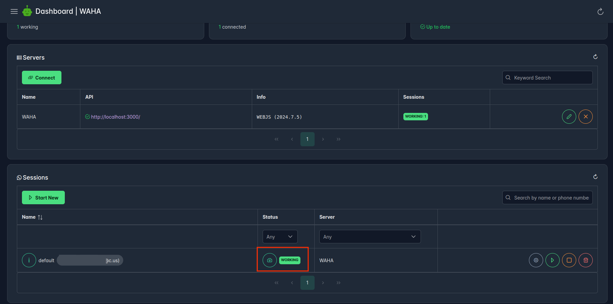
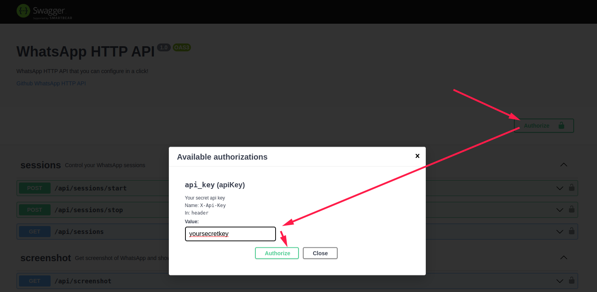



## Step-by-Step guide
On this page, you're going to install and run WAHA,
authenticate the client using a QR code,
and send **your first message** to WhatsApp using the API!

We will guide you through the necessary steps to successfully send your first text message using the WhatsApp API.

<div class='article-card'>
  <b class='h4'>Are you a visual learner?</b>

We've got you covered! <br/>
Watch the video tutorial below to see how to send your first message using <b>WAHA</b>

  <div class="d-flex justify-content-center my-4">
    <iframe
      width="100%" 
      height="315"
      src="https://www.youtube.com/embed/RFerMyAUPRg"
      title="YouTube video player"
      frameborder="0"
      allow="accelerometer; autoplay; clipboard-write; encrypted-media; gyroscope; picture-in-picture; web-share"
      allowfullscreen
    ></iframe>
  </div>
</div>


## Step 0. Requirements

WAHA works on top of **Docker**, that's the only thing you'll need!
<div class="text-center">
   
</div>

👉 Please follow the
<a href="https://docs.docker.com/engine/install/" target="_blank">
    <b>Docker official guides to install it on Linux, Windows, and macOS</b>
</a>


Docker makes it easy to ship an **all-in-one solution** with the runtime and dependencies. 
You don't have to worry about language-specific libraries or Chrome installation.

Also, Docker makes installation and update processes so simple, just one command!


## Step 1. Download image

Assuming you have installed [Docker](https://docs.docker.com/get-docker/), let's download the image!
Follow the instructions below:



## Step 2. Init WAHA

Generate a `.env` file that we'll use in the next step for credentials:

```bash {title="Init WAHA"}
docker run --rm -v "$(pwd)":/app/env devlikeapro/waha init-waha /app/env
```



Remember these values (you can always check the `.env` file if you forget them):
- **Username / Password**: `admin / 11...11` - use them to access the Dashboard and Swagger UI
- **Api Key**: `00...00` - use it to connect to your server

👉 You can change variables to any values, but use **long strings** (like **UUIDv4**) 

## Step 3. Run WAHA

Run WhatsApp HTTP API:

```bash
docker run -it --env-file "$(pwd)/.env" -v "$(pwd)/sessions:/app/.sessions" --rm -p 3000:3000 --name waha devlikeapro/waha
```


☝️ The above command is meant only for **initial testing**, not for production use.

Please follow the [**🔧 Install & Update**]() guide to set up a secure WAHA instance
after you finish the quick start guide.



 Now, open the [📊 Dashboard]() at
<a href="http://localhost:3000/dashboard" target="_blank">
<b>http://localhost:3000/dashboard</b>
</a>

Use **username/password** from the previous step (`.env` file - `WAHA_DASHBOARD_USERNAME / WAHA_DASHBOARD_PASSWORD`):


Next, connect to the server using **api key** from the previous step (`.env` file - `WAHA_API_KEY`):


## Step 4. Start a new session

To start a new session, you should have your mobile phone with the **WhatsApp application** installed close to you.

Here is the 
<a href="https://faq.whatsapp.com/381777293328336/?helpref=hc_fnav" target="_blank">
official instruction on WhatsApp site
</a>
on how to log in.

Now you can start the **default** session (current status should be `STOPPED`).

You can leave all configuration parameters as default:


## Step 5. Get and scan QR

Wait until the session status is `SCAN_QR` and click on the "camera" icon:
<br>

👉 If instead of the QR you see **Click to reload QR** - **stop** the session and **start** it again.

<br>

You'll see the QR code from the WhatsApp Web app. Now get **your phone** with the WhatsApp application installed and **scan the QR**:


The session status will move to `WORKING` status:


## Step 6. Send a text message

Now we're ready to send the first messages to WhatsApp via the API!

- Replace `123123` with **your phone number without +**, but keep the `@c.us` part. 
- Use the API key from your `.env` file (`WAHA_API_KEY`). 

The examples below use a placeholder `00000000000000000000000000000000` - swap it with your real value:



```sh
curl -X 'POST' \
  'http://localhost:3000/api/sendText' \
  -H 'accept: application/json' \
  -H 'Content-Type: application/json' \
  -H "X-Api-Key: 00000000000000000000000000000000" \
  -d '{
  "chatId": "123123@c.us",
  "text": "Hi there!",
  "session": "default"
}'
```



```js
fetch('http://localhost:3000/api/sendText', {
  method: 'POST',
  headers: {
    'Accept': 'application/json',
    'Content-Type': 'application/json',
    'X-Api-Key': '00000000000000000000000000000000'
  },
  body: JSON.stringify({
    chatId: "123123@c.us",
    text: "Hi there!",
    session: "default"
  })
})
.then(response => response.json())
.then(data => console.log(data))
.catch(error => console.error('Error:', error));
```



```python
import requests

url = "http://localhost:3000/api/sendText"
headers = {
    "Accept": "application/json",
    "Content-Type": "application/json",
    "X-Api-Key": "00000000000000000000000000000000"
}
data = {
    "chatId": "123123@c.us",
    "text": "Hi there!",
    "session": "default"
}

response = requests.post(url, json=data, headers=headers)
print(response.json())
```




As alternative to `curl`, you can use [**📚 Swagger**]() for that.

Open Swagger at
<a href="http://localhost:3000/#/chatting" target="_blank">
<b>http://localhost:3000/#/chatting</b>
</a>. 

**Authorize** using the **Api Key** (`.env` file - `WAHA_API_KEY`):



- Scroll down to **chatting** section.
- Find `POST /api/sendText` endpoint and expand it
- Click **Try it out**
- Replace `123123@c.us` with **your phone number without +**, but keep `@c.us` part
- Click **Execute**


## What's next?




Ask [**🤖 WAHA GPT**]() to help you build **{python|js|php}** code!



