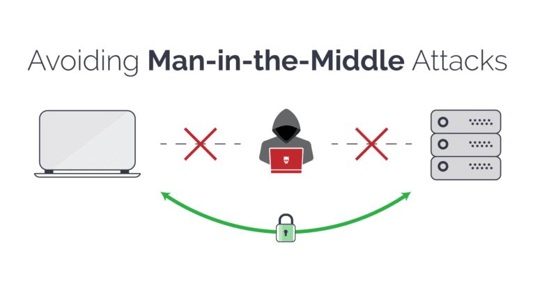
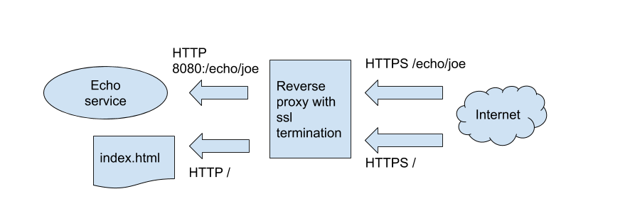

## Why bother with HTTPS?

Even if you have set up WAHA and protected it with an API key and username/password
(as we recommend on [**🔒 Security**]()) - it's still not enough, because of
[Man-in-the-middle attacks](https://en.wikipedia.org/wiki/Man-in-the-middle_attack).


If you're exposing WAHA to the internet, you should **always use HTTPS** to protect your data from being intercepted.

👉 WAHA **supports HTTPS out of the box** in [**WAHA Plus**]() version.

You can set up the following environment variables to enable HTTPS:

1. [**Let's Encrypt**](#lets-encrypt-certbot--waha) - use [Certbot](https://certbot.eff.org/) to get a free certificate from Let's Encrypt.
2. [**Self-signed certificate**](#self-signed-certificate--waha) - generate a self-signed certificate and use it for HTTPS.
3. [**Using reverse proxy**](#using-external-reverse-proxy) - use Nginx as a reverse proxy and set up HTTPS there.
4. [**Using Ngrok**](#using-ngrok) - expose your WAHA safely on internet, even without Public IP or DNS name.

## Configuration


WAHA supports HTTPS out of the box if you don't want to use a reverse proxy like Nginx.

You can set up the following environment variables to enable HTTPS:

- `WAHA_HTTPS_ENABLED=true`: Set this variable to `true` to enable HTTPS. By default, it's `false`.
- `WAHA_HTTPS_PATH_KEY=/path/to/key.pem`: The path to the key file for HTTPS. By default `./.secrets/privkey.pem`
- `WAHA_HTTPS_PATH_CERT=/path/to/cert.pem`: The path to the certificate file for HTTPS. By default `./.secrets/cert.pem`
- `WAHA_HTTPS_PATH_CA=/path/to/ca.pem`: The path to the CA file for HTTPS. By default `./.secrets/chain.pem`

## Let's Encrypt (Certbot) + WAHA


[**Certbot**](https://certbot.eff.org/) is a free and open-source tool that can be used to get a free certificate
from [Let's Encrypt](https://letsencrypt.org/).

WAHA can use the certificate generated by Certbot to enable HTTPS.

### Step 0: Requirements

Here's assumptions for this guide:

1. **Dedicated server or VPS** with Public IP (
   like [DigitalOcean DropLet](https://www.digitalocean.com/products/droplets/))
2. **Ubuntu 22.04** - clean installation
3. **Public IP** assigned to the server (like `109.71.242.111`)
4. **Domain** pointed to the Public IP (like `waha.example.pro`)

You can get the updated [Certbot documentation](https://certbot.eff.org/instructions?ws=other&os=ubuntufocal),
and **Step 7: Install your certificate** - this is where we need to configure WAHA to use the certificates.

### Step 1: Install Certbot

```bash
sudo snap install --classic certbot
sudo ln -s /snap/bin/certbot /usr/bin/certbot
```

### Step 2: Issuing certificate

Choose how you'd like to run Certbot - Are you ok with temporarily stopping your website?

- **Yes, my web server is not currently running on this machine.**

Stop your webserver, then run this command to get a certificate. Certbot will temporarily spin up a webserver on your
machine.

```bash
sudo systemctl stop nginx
sudo certbot certonly --standalone -d waha.example.com # <=== change to your domain
```

- **No, I need to keep my web server running.**

```bash
sudo certbot certonly --webroot
# sudo certbot certonly --webroot /var/www/html
```

### Step 3: Run WAHA

After you get the certificates, you can run it

👇 Few notes:
- Change `waha.example.pro` to your domain
- We're running it with `-it` flag to see the logs, in production you need to run it with `docker run -d` instead.
- We map the whole `/etc/letsencrypt` folder because of the way how letsencrypt works with "live" keys (it's symlinks to "archive" directory files)

```bash
DOMAIN=waha.example.pro # Change it to your domain!

docker run -it \
  -p 3000:3000/tcp \
  -v $(pwd)/.sessions:/app/.sessions \
  -v /etc/letsencrypt:/etc/letsencrypt \
  --env WHATSAPP_API_HOSTNAME=$DOMAIN \
  --env WAHA_HTTPS_ENABLED=true \
  --env WAHA_HTTPS_PATH_KEY=/etc/letsencrypt/live/$DOMAIN/privkey.pem \
  --env WAHA_HTTPS_PATH_CERT=/etc/letsencrypt/live/$DOMAIN/cert.pem \
  --env WAHA_HTTPS_PATH_CA=/etc/letsencrypt/live/$DOMAIN/chain.pem \
  --restart always \
  devlikeapro/waha-plus
```

Now open [https://waha.example.com:3000](https://waha.example.com:3000)
and check the HTTPS connection.

If it works - consider using [docker-compose](https://github.com/devlikeapro/waha/blob/core/docker-compose.yaml) 
file for running the project, it can be hard to write such long command or using sh scripts for that.

### Step 4: Test auto renewal

When Certbot renew the certificate - WAHA automatically updates HTTPS server and use new certificate with no restart.

```bash
sudo certbot renew --dry-run
```

## Self-signed certificate + WAHA

As an alternative, you can issue self-signed certificate (for instance, to test the connection on localhost).

It'll show you an error on browser, so you need to accept it before accessing the site, 
but it won't show expose the API key during network communication even in public networks.


### Step 1: Generate certificates
```bash
mkdir .secrets
openssl genpkey -algorithm RSA -out .secrets/privkey.pem -pkeyopt rsa_keygen_bits:2048
openssl req -new -key .secrets/privkey.pem -out .secrets/cert.csr -subj "/"
openssl req -x509 -days 3650 -key .secrets/privkey.pem -in .secrets/cert.csr -out .secrets/cert.pem
cp .secrets/cert.pem .secrets/chain.pem
echo "DONE!"
```

### Step 2: Run WAHA
👇 Few notes:
- We're running it with `-it` flag to see the logs, in production you need to run it with `docker run -d` instead.

```bash
docker run -it \
  -p 3000:3000 \
  -v $(pwd)/.sessions:/app/.sessions \
  -v $(pwd)/.secrets:/app/.secrets \
  -e WAHA_HTTPS_ENABLED=true \
  -e WAHA_HTTPS_PATH_KEY=.secrets/privkey.pem \
  -e WAHA_HTTPS_PATH_CERT=.secrets/cert.pem \
  -e WAHA_HTTPS_PATH_CA=.secrets/chain.pem \
  devlikeapro/waha-plus
```

Open [https://localhost:3000](https://localhost:3000) and accept self-signed certificate in your browser.

If it works - consider using [docker-compose](https://github.com/devlikeapro/waha/blob/core/docker-compose.yaml)
file for running the project, it can be hard to write such long command or using sh scripts for that.

## Using External Reverse Proxy


The best way to set up HTTPS is to use a reverse proxy like Nginx.
The idea is WAHA exposes the HTTP port and Nginx handles the HTTPS part and forwards the requests to WAHA.
It distributes the load and make it easier to manage the HTTPS part.

Unfortunately, it's a bit more complicated than the previous options, so we don't cover it in the guide.

Here's some articles that can help you set up HTTPS with Nginx and docker-compose:
1. [**Certbot + Nginx + Docker**](https://www.digitalocean.com/community/tutorials/how-to-secure-nginx-with-let-s-encrypt-on-ubuntu-20-04)

## Using Ngrok
WAHA + Ngrok - Running WAHA on local network
You also can set up [**WAHA to use Ngrok**]() 
so it handles HTTPS for you, even if you're running it NOT on local server!
